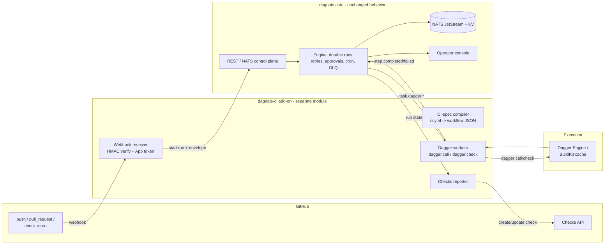

# DagNats CI: Durable Orchestration of Dagger Pipelines

**Status:** Draft spec — pending review
**Date:** 2026-06-19
**Scope:** Run our Dagger-based CI/CD on DagNats. DagNats is the durable
orchestrator; Dagger is the execution engine. GitHub is the event source and
status surface.
**Decision artifact:** the load-bearing choices here (CI lives in a separate
add-on; DagNats orchestrates, Dagger executes; the public extension seam) should
be formalized as **ADR-023** in Phase 0.

---

## 1. Problem

We want CI/CD for our repositories (starting with `dagnats` itself) that:

- runs reproducible, cached, containerized pipelines, and
- is driven by GitHub events, reports status back to GitHub, and
- supports **durable, long-horizon** workflows: human approval gates before
  deploy, scheduled/backfilled runs, durable retries that survive a restart,
  and multi-repo fan-out — none of which a per-commit check runner provides.

Two existing tools each solve half of this and neither solves both:

- **Dagger** is an excellent *execution engine* (BuildKit-backed,
  content-addressed cache, lazy DAG, secrets, services, 8 SDKs, a module
  ecosystem). But a Dagger session runs to completion and dies. It has **no**
  cron/scheduling, **no** event-sourced durable state, **no** wait-for-signal /
  approval gates, **no** cross-run/cross-repo coordination. Verified by absence
  in the upstream tree: `\b(cron|schedule|backfill)\b` has zero hits in
  `core/` and `docs/current_docs/`; "durable" in their docs means a durable
  *interface*, not durable *execution*.
- **Dagger Cloud** already ships GitHub-App + webhook + Checks + managed
  compute (`docs/.../reference/configuration/cloud.mdx`), but it is paid SaaS,
  stateless-per-commit, and reports plain commit statuses. It does not do
  durable, long-horizon orchestration either.

- **DagNats** is exactly a durable orchestrator: event-sourced runs over NATS
  JetStream, KV state snapshots, retries/timeouts/concurrency, approvals, cron,
  signals, DLQ, an operator console. It has **no** container execution
  substrate.

The two compose cleanly. DagNats becomes the layer above Dagger.

## 2. Goals and non-goals

### Goals

- A standing, self-hosted control plane: GitHub event → DagNats run → Dagger
  execution → GitHub Check, with full run history in the DagNats console.
- Keep the `dagnats` core **clean**: CI/GitHub/Dagger specifics live in a
  separate add-on module. Core gains only a small, general-purpose public seam.
- Make DagNats's durability the headline feature: approval gates, scheduling,
  durable retry/DLQ, multi-repo fan-out — things Dagger Cloud cannot do.
- Author CI as Dagger functions/checks (in each repo's own Dagger module). The
  add-on orchestrates *which* functions run, *when*, and *with what gates*.

### Non-goals

- **Not** reimplementing BuildKit, container execution, snapshotting, or the
  Dagger cache. Dagger owns execution.
- **Not** a GitHub Actions YAML interpreter or a self-hosted Actions runner
  (GitHub keeps job scheduling in that model; we want to be the scheduler).
- **Not** competing with Dagger Cloud on plain per-commit checks. If a repo
  only needs "push → run checks → status," Dagger Cloud already does that and
  DagNats adds little. We target the durable/long-horizon cases.
- **Not** putting any GitHub or Dagger import inside `dagnats` core packages.

## 3. Architecture



Boundary rule: **everything GitHub- or Dagger-specific is in the add-on.** Core
sees a normal run started with a JSON input, normal task dispatch, normal
events. The add-on imports `dagnats`'s public `worker`, `dag`, `protocol`
packages plus one new public seam (§5.1).

## 4. Components

### 4.1 Core changes (in `dagnats`)

Two small, general-purpose changes. Both are useful beyond CI.

#### (a) Public extension seam — REQUIRED

Today `worker.RegisterTriggerType` and `worker.WatchTriggers` take
`internal/trigger.TriggerTypeDef` / `TriggerDef`. An external module **cannot
name those types** because they live under `internal/`. This is the only thing
blocking a clean external add-on.

Fix: introduce a public package (proposed name `dagnatsext`, to avoid collision
with the existing Synadia "orbit extensions" terminology in
`docs/architecture/orbit-extensions.md`) holding the DTOs that cross the SDK
boundary:

```go
package dagnatsext

type TriggerTypeDef struct {
    Name          string
    Description   string
    ConfigSchema  json.RawMessage
    PayloadSchema json.RawMessage
    Version       string
}

type TriggerDef struct {
    ID         string
    WorkflowID string
    Enabled    bool
    External   ExternalTriggerConfig
}

type ExternalTriggerConfig struct {
    Kind   string
    Config json.RawMessage
}

type TriggerEnvelope struct {
    Trigger    string
    Source     string
    WorkflowID string
    Timestamp  time.Time
    Data       json.RawMessage
}
```

`internal/trigger` keeps its types (or aliases them to `dagnatsext`); the
`worker` SDK methods switch their signatures to the public types. Internal
storage/validation is unchanged. Clean cutover — no shims, migrate the two SDK
method signatures and the internal call sites.

#### (b) Deliver per-step config to workers — RECOMMENDED

`TaskContext` exposes only `Input/RunID/StepID/RetryCount/Context`, and
`dag.ResolveInput` feeds a step either the run-level input (entry steps) or
upstream step outputs (`dag/resolve.go`). **Step `metadata` is never delivered
to the worker** (`protocol.TaskPayload` has no metadata field). A Dagger worker
therefore has no first-class way to learn *which* function to call for the step
it is executing.

Two options:

1. **No-core-change fallback:** the worker reads the registered workflow def
   from the `workflow_defs` KV bucket (RunID → WorkflowID via `workflow_runs`,
   then `step.Metadata` by StepID). Works today, but couples the worker to KV
   layout and adds a read per task.
2. **Recommended core enhancement:** add `Metadata map[string]string` to
   `protocol.TaskPayload`, populated from `StepDef.Metadata` in
   `collectReadyMessages`, and expose `ctx.Metadata()` on `TaskContext`. ~30
   lines, general-purpose (any worker benefits from static per-step config),
   and removes the KV round-trip. This is the cleaner seam and is the
   recommended path.

Decision: ship (b). It is small, broadly useful, and makes the CI compiler's
output trivial (the Dagger call is just step metadata).

### 4.2 The `dagnats-ci` add-on (separate module/repo)

```
dagnats-ci/
  go.mod                       # imports github.com/danmestas/dagnats/{worker,dag,protocol,dagnatsext}
  cmd/dagnats-ci/main.go       # `dagnats-ci serve`
  internal/
    githubapp/
      auth.go                  # App JWT -> installation access token
      webhook.go               # HMAC-SHA256 verify (X-Hub-Signature-256), event parse
      checks.go                # Checks API client (create/update/annotate)
    ingest/
      router.go                # event -> {repo, sha, ref, pr, installation_id} -> run start
    compile/
      spec.go                  # parse .dagnats/ci.yml
      workflow.go              # compile -> dag.WorkflowDef JSON
    runner/
      dagger.go                # dagger.call / dagger.check / dagger.shell workers
      workspace.go             # per-run checkout dir lifecycle + GC
  examples/
    dagnats/ci.yml             # dogfood: dagnats's own CI
```

The add-on runs as one process that:

1. Serves an HTTPS webhook endpoint for GitHub.
2. Verifies signatures, exchanges App credentials for installation tokens.
3. Starts a DagNats run (Phase 1) or fires a `github` external trigger
   (Phase 3) with the event as the run input.
4. Hosts the Dagger workers (connected to the same NATS) that execute steps.
5. Reports run state back to GitHub via the Checks API.

## 5. Data model and contracts

### 5.1 GitHub event → run input (the trigger envelope)

On a verified webhook, the add-on starts a run whose input is the standard
`TriggerEnvelope` with GitHub data:

```json
{
  "trigger": "github",
  "source": "github:danmestas/dagnats",
  "data": {
    "event": "pull_request",
    "action": "synchronize",
    "owner": "danmestas",
    "repo": "dagnats",
    "head_sha": "abc123…",
    "base_ref": "main",
    "pr": 412,
    "installation_id": 987654,
    "clone_url": "https://github.com/danmestas/dagnats.git"
  }
}
```

Because entry steps receive the run input verbatim (`dag.ResolveInput`, no
deps → run input), the first Dagger step sees exactly the repo + SHA it must
check out.

### 5.2 CI definition format (`.dagnats/ci.yml`)

Authored per repo. Names *which* Dagger functions/checks to run and *what gates*
apply. This is where DagNats's differentiators (approval, schedule) are
expressed declaratively:

```yaml
on:
  pull_request: { branches: [main] }
  push:         { branches: [main] }
  schedule:     { cron: "0 6 * * *" }     # DagNats-only: scheduled CI

defaults:
  module: "."        # Dagger module path in the repo
  engine: auto       # auto-provision or connect to a Dagger Engine

checks:
  test:  { call: "test" }
  lint:  { call: "lint" }
  build: { call: "build", needs: [test, lint] }

deploy:
  needs: [build]
  approval: required                       # DagNats-only: durable human gate
  call: "publish --tag=${HEAD_SHA}"
  branches: [main]                         # never deploy from a PR/fork
```

### 5.3 Compiled DagNats workflow

The compiler emits a normal `dag.WorkflowDef`. Each check/deploy is a step whose
`task` is a Dagger verb and whose `metadata` carries the Dagger call:

```json
{
  "name": "ci:danmestas/dagnats",
  "version": "1.0.0",
  "timeout": "45m",
  "steps": [
    { "id": "test",  "task": "dagger.call", "type": "normal", "timeout": "20m",
      "metadata": { "module": ".", "call": "test" } },
    { "id": "lint",  "task": "dagger.call", "type": "normal", "timeout": "10m",
      "metadata": { "module": ".", "call": "lint" } },
    { "id": "build", "task": "dagger.call", "type": "normal", "timeout": "15m",
      "depends_on": ["test", "lint"],
      "metadata": { "module": ".", "call": "build" } },

    { "id": "approve-deploy", "task": "ci.approval", "type": "normal",
      "timeout": "24h", "depends_on": ["build"] },

    { "id": "deploy", "task": "dagger.call", "type": "normal", "timeout": "15m",
      "depends_on": ["approve-deploy"],
      "skip_if": { "step_id": "build", "field": "branch", "op": "!=", "value": "main" },
      "metadata": { "module": ".", "call": "publish" } }
  ]
}
```

- `needs:` → `depends_on`. The DAG, fan-out, and skip semantics are pure core.
- `approval: required` → an approval step that waits on
  `EventApprovalRequested`/`EventApprovalGranted` (already in `protocol`). This
  is the long-horizon gate Dagger Cloud has no answer for.
- `schedule.cron` → a DagNats cron trigger on the compiled workflow.

### 5.4 Worker contract

Workers register on the add-on side using the public SDK:

```go
w := worker.NewWorker(nc)
w.Handle("dagger.call", daggerCall)   // ctx.Metadata()["module"], ["call"], ctx.Input() = envelope
w.Handle("dagger.check", daggerCheck)
w.Handle("ci.approval", approvalGate) // requests approval, waits for signal
w.Start()
```

`daggerCall` reads `ctx.Metadata()` for `module`/`call`, reads `ctx.Input()` for
the repo+SHA, runs Dagger, and reports via `ctx.Complete` / `ctx.Fail`. Long
builds call `ctx.Heartbeat()` to hold the AckWait. The engine remains the sole
retry authority (ADR-011); workers stay thin.

## 6. Execution model (Dagger)

Phase 1 shells out to the Dagger CLI — the most boring thing that works:

```bash
# inside daggerCall, in a per-run workspace already checked out at head_sha
dagger -m "$MODULE" call $CALL --progress=plain
```

- **Checkout:** the worker clones `clone_url` at `head_sha` into a fresh,
  bounded workspace (using the installation token for private repos).
- **Cache/secrets/services:** owned by the Dagger Engine. The worker passes
  secrets as Dagger secret providers (`env://`, `op://`, `vault://`), never
  inline. Dagger redacts secrets from logs and keeps them out of the cache.
- **Logs:** the worker streams stdout via `ctx.PutStream` for live console
  tailing, and stores the full log artifact for the Check `details_url`.
- **Engine placement:** `engine: auto` lets Dagger provision/connect; a shared
  long-lived engine (or Dagger Cloud engine via `--cloud`) gives persistent
  layer cache across runs. Worker groups (`worker.WithGroups`) map to engine
  pools (e.g. `linux-amd64`, `linux-arm64`, `gpu`).

A later phase may use the Dagger Go SDK directly where the CLI is too coarse,
but the CLI keeps Phase 1 small and dependency-light.

## 7. Security model

Driven by the GitHub research (Checks require a GitHub App; fork PRs are
hostile by default):

- **GitHub App, not PAT.** Checks API create/update is App-only. The App holds
  least-privilege permissions: Metadata, Contents (read, for checkout), Checks
  (write), Pull requests (read). Add Workflows only if we ever edit
  `.github/workflows`.
- **Webhook verification.** Reject any delivery whose `X-Hub-Signature-256`
  HMAC does not match the configured secret. De-dup on `X-GitHub-Delivery`.
- **Installation tokens.** App JWT → installation access token (1 h), scoped to
  the repo, used for checkout and Checks calls.
- **Fork/untrusted PRs.** No secrets and no deploy steps for fork PRs. The
  `deploy` step is `branches: [main]`-gated and `skip_if` non-main. Per-run
  workspace isolation, bounded resources, secret masking, no shared mutable
  credentials. (GitHub explicitly warns against persistent runners executing
  untrusted PR code — isolation is mandatory, see §11 Phase 4.)

## 8. Why this earns DagNats's place (the differentiators)

These are the features that justify orchestrating with DagNats instead of just
using Dagger / Dagger Cloud. Each maps to an existing core capability:

| CI need | DagNats primitive | Dagger Cloud? |
|---|---|---|
| Manual approval before deploy | approval events + WaitForSignal | No |
| Scheduled / nightly / backfilled CI | cron trigger + scheduled_runs KV | No |
| Durable retry that survives a restart | engine retry authority + event sourcing | No |
| Failed-run triage / replay | DEAD_LETTERS stream + `dlq replay` | No |
| Multi-repo fan-out with rate limits | concurrency KV + worker groups | No |
| Cross-workflow coordination | KV signals | No |
| Persistent self-hosted run history/console | console + WORKFLOW_HISTORY | Partial (SaaS traces) |

Positioning the product around this table — not around "another check runner" —
is what keeps the effort defensible.

## 9. Observability

- Each DagNats run maps to one GitHub Check run; the Check `details_url` deep-
  links to the run page in the DagNats console.
- The console already shows event history, retries, DLQ, and a metrics
  dashboard — CI runs appear there for free once runs are started.
- OTel traces already flow through the engine; the Dagger execution emits its
  own OTel spans. Phase 5 links the two by propagating `traceparent` from the
  task into the Dagger invocation.

## 10. Phased plan

Each phase is independently shippable and ends with an observable result. After
the spec is approved, slice phases into issues (`to-issues`) and fan
implementation out to subagents.

### Phase 0 — Decision + core seam
- [ ] Write **ADR-023** capturing: add-on (not core) ownership; DagNats-
      orchestrates / Dagger-executes; the public extension seam.
- [ ] Add the public `dagnatsext` package; switch `worker.RegisterTriggerType`
      / `WatchTriggers` to public DTOs; migrate internal call sites.
- [ ] Add `TaskPayload.Metadata` + `TaskContext.Metadata()`; populate in
      `collectReadyMessages`.
- **Acceptance:** an out-of-tree Go module can `import
  github.com/danmestas/dagnats/{worker,dag,protocol,dagnatsext}`, register a
  task handler, and read `ctx.Metadata()`. `make test` + `make lint` green.

### Phase 1 — Vertical slice: PR → Dagger check → GitHub Check
- [ ] `dagnats-ci` module skeleton + `serve`.
- [ ] GitHub App auth + webhook verify (`push`, `pull_request`).
- [ ] On verified event: start a DagNats run with the envelope.
- [ ] `dagger.call` worker: checkout + `dagger call` + complete/fail + log
      stream.
- [ ] Checks reporter: create check `queued` → `in_progress` → `completed`
      with conclusion + summary; `details_url` → console.
- **Acceptance:** open a PR on a test repo with a `test` Dagger function; a
  GitHub Check goes green/red; the console shows the run; the Check links to it.

### Phase 2 — CI spec compiler + DAG
- [ ] Parse `.dagnats/ci.yml`; compile to `dag.WorkflowDef` with `needs` →
      `depends_on`.
- [ ] Register/refresh the compiled workflow on the relevant events.
- **Acceptance:** a multi-check `ci.yml` (test+lint→build) runs as a DAG with
  correct fan-out and a Check per check.

### Phase 3 — Durability features (the differentiators)
- [ ] `approval: required` → approval step + a console/CLI approve action
      (reuse ADR-022 gated write actions).
- [ ] `schedule.cron` → cron trigger on the compiled workflow.
- [ ] Model `github` as a first-class external trigger kind for console/trigger
      visibility (`RegisterTriggerType` + `WatchTriggers`).
- **Acceptance:** a deploy waits for human approval and only then runs; a
  nightly run fires on schedule; GitHub triggers appear in `dagnats trigger
  list` and the console.

### Phase 4 — Isolation & secrets hardening
- [ ] Per-run workspace with bounded disk/CPU/mem/wall-clock + GC.
- [ ] Secret providers wired through Dagger; fork-PR secret withholding;
      deploy gating to protected branches.
- [ ] Cache isolation by repo/trust boundary.
- **Acceptance:** a fork PR runs tests with no secrets and cannot deploy; a
  runaway job is bounded and cleaned up; secrets never appear in logs.

### Phase 5 — Polish
- [ ] Artifact storage + Check annotations from failing tests/lint.
- [ ] Rerun/cancel from the GitHub Check actions surface.
- [ ] `traceparent` propagation into Dagger; unified trace view.
- **Acceptance:** a failing lint produces inline annotations; "Re-run" from
  GitHub restarts the DagNats run; one trace spans webhook → run → Dagger.

## 11. Acceptance criteria (overall)

The slice is "done" when, on a real repo:

1. A `pull_request` webhook starts a DagNats run whose input carries the
   correct `head_sha`.
2. `dagger call test` (and `lint`, `build`) execute as a DAG with live logs in
   the console.
3. A GitHub Check transitions queued → in_progress → completed with a useful
   summary and a `details_url` to the DagNats run.
4. A `deploy` step waits for a human approval recorded in DagNats and only then
   runs `dagger call publish`, never from a fork/PR.
5. A nightly schedule fires the same workflow with no webhook.
6. Core `make test` + `make lint` stay green; no GitHub/Dagger import appears
   in any `dagnats` core package.

## 12. Risks and non-goals

- **Risk — Dagger Cloud overlap.** For plain per-commit checks, Cloud already
  does this. Mitigation: lead with the §8 durability features; treat plain
  checks as table stakes, not the pitch.
- **Risk — untrusted PR execution.** Self-hosted runners executing fork code is
  a known severe risk. Mitigation: Phase 4 isolation is a hard gate before any
  public-repo use; secrets/deploy are withheld from forks by construction.
- **Risk — Dagger Engine lifecycle/cache contention.** A shared engine is
  faster but a shared-state surface. Mitigation: start with auto/ephemeral
  engines; introduce a shared engine with cache isolation deliberately.
- **Risk — CLI coupling.** Shelling to `dagger` ties us to CLI output/flags.
  Mitigation: confine it to the `runner/dagger.go` worker; swap to the Go SDK
  behind the same task contract if needed.
- **Non-goal:** GitHub Actions YAML import, Actions-runner emulation, a
  multi-tenant hosted product. Single-org self-hosted first.
- **Non-goal:** any GitHub/Dagger code in `dagnats` core beyond the
  general-purpose seams in §4.1.

## 13. Open questions

1. **Engine topology:** ephemeral per-run Dagger engines (simplest, isolated)
   vs. a shared long-lived engine (fast cache reuse, shared-state risk)?
   Recommendation: ephemeral in Phase 1, shared+isolated as an opt-in later.
2. **Add-on repo name:** `dagnats-ci` vs `dagnats-github-ci` (leaves room for
   GitLab/Forgejo adapters later)?
