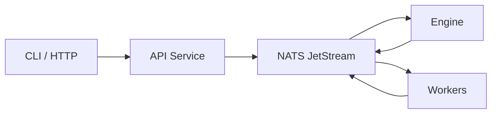

DagNats is a DAG-based workflow engine built on NATS JetStream for orchestrating durable workflows and autonomous LLM coding pipelines.

## The Problem

Multi-step workflows -- deploy pipelines, code review bots, data processing chains -- need retries, timeouts, dependency ordering, and observability. Most workflow engines require external databases (Postgres, Redis, MySQL) alongside a separate message broker. This creates deployment complexity, operational burden, and failure modes that have nothing to do with your actual workflows.

## What DagNats Does

DagNats combines the **workflow engine** and the **message broker** into a single system by building directly on **NATS JetStream**. You define workflows as directed acyclic graphs (DAGs) in JSON, register them with the server, and write workers that handle individual steps. The engine resolves dependencies, dispatches tasks, handles retries, and tracks state -- all through NATS primitives.

The core execution model is **event sourcing**. Every state change is an immutable event on a JetStream stream. The engine is stateless: it replays the event log to reconstruct workflow state. There is no mutable database row to corrupt or lose.

## Key Differentiators

- **Single binary** -- `dagnats serve` starts an embedded NATS server, the workflow engine, the API, and an HTTP gateway. No external dependencies.
- **No external database** -- JetStream provides streams, key-value stores, and object storage. All state lives in NATS.
- **Event-sourced** -- Immutable event log is the source of truth. KV snapshots are a convenience, not authoritative.
- **NATS-native** -- Retries use `NakWithDelay`, timeouts use `AckWait`, signals use KV watches, dedup uses `Nats-Msg-Id`.
- **Agent loops as a primitive** -- Built-in `agent_loop` step type for iterative LLM agent execution with bounded iterations and duration.

## Architecture

All communication flows through NATS -- no direct connections between components. The engine watches the event stream, resolves the DAG, and dispatches tasks. Workers pull tasks, execute them, and publish results back.

## Next Steps

- [Quickstart](/docs/get-started/quickstart) -- zero to running in five minutes
- [Core Concepts](/docs/concepts) -- workflows, steps, events, and the DAG model
- [Architecture](/docs/architecture) -- deep dive into the engine and NATS primitives
