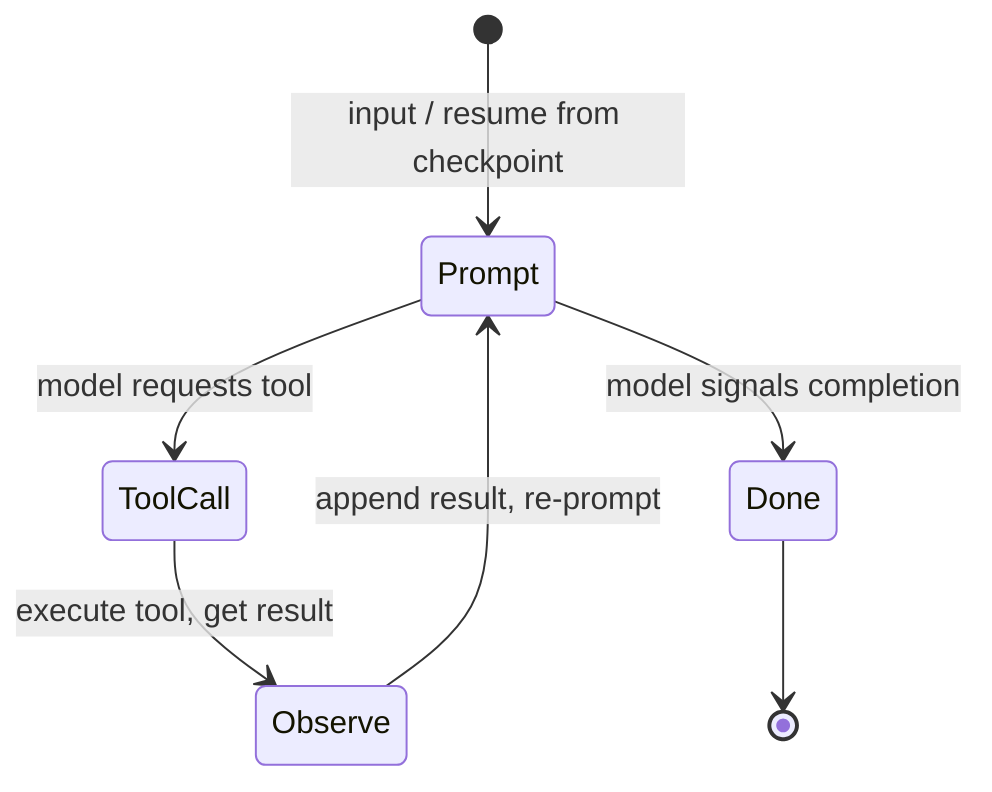

The agent loop pattern maps the LLM reasoning cycle -- prompt, tool call, observe, decide -- onto a single DagNats step that iterates with checkpointed state.

## The Reasoning Cycle

Every LLM agent follows the same core loop:



The number of cycles is unknown at definition time. A simple question might resolve in 1 cycle. A complex coding task might take 15. The [agent loop step type](/docs/step-types/agent-loops) handles this natively: the handler calls `Continue()` to request another iteration or `Complete()` to terminate.

## Mapping to DagNats

| LLM Concept | DagNats Primitive |
|------------|-------------------|
| One reasoning cycle | One agent loop iteration |
| Conversation history | [Checkpoint](/docs/coordination/checkpoints) in KV |
| "Keep going" decision | `Continue(output)` |
| "I'm done" decision | `Complete(output)` |
| Iteration cap | `MaxIterations` |
| Time cap | `MaxDuration` |
| Per-iteration timeout | `StepDef.Timeout` |
| Rate limit spacing | `LoopDelay` |

## Workflow Definition

```go
wf := dag.NewWorkflow("code-review-agent")

agent := wf.AgentLoop("review", "llm-review").
    WithMaxIterations(20).
    WithMaxDuration(10 * time.Minute).
    WithLoopDelay(1 * time.Second).
    WithTimeout(60 * time.Second)

def, err := wf.Build()
```

`MaxIterations` is your hard bound on LLM calls. `MaxDuration` caps total wall-clock time. `Timeout` applies per-iteration -- if a single LLM call hangs, that iteration times out and retries. `LoopDelay` adds spacing between iterations for rate-limited APIs.

## Handler Implementation

The handler follows a consistent structure: load state, execute one cycle, save state, decide.

```go
w.Handle("llm-review", func(ctx worker.TaskContext) error {
    // 1. Load or initialize conversation
    var messages []Message
    if saved, _ := ctx.LoadCheckpoint(); saved != nil {
        json.Unmarshal(saved, &messages)
    } else {
        messages = []Message{
            {Role: "system", Content: systemPrompt},
            {Role: "user", Content: string(ctx.Input())},
        }
    }

    // 2. Call the LLM
    response, err := callLLM(messages)
    if err != nil {
        return ctx.Fail(err)
    }
    messages = append(messages, response.Message)

    // 3. Execute tool calls if requested
    if response.HasToolCalls() {
        for _, call := range response.ToolCalls {
            result := executeTool(call)
            messages = append(messages, toolResultMessage(call, result))
        }
    }

    // 4. Save state
    data, _ := json.Marshal(messages)
    ctx.Checkpoint(data)

    // 5. Decide: continue or complete
    if response.Done || !response.HasToolCalls() {
        return ctx.Complete(extractFinalAnswer(messages))
    }
    return ctx.Continue(nil)
})
```

## Exit Conditions

An agent loop terminates when any of these conditions is met:

| Condition | Who Enforces | What Happens |
|-----------|-------------|--------------|
| Handler calls `Complete()` | Worker | Step completes successfully |
| Handler calls `Fail()` | Worker | Step fails (retry policy applies) |
| `MaxIterations` reached | Engine | Step fails with iteration limit error |
| `MaxDuration` exceeded | Engine | Step fails with duration limit error |
| Per-iteration `Timeout` exceeded | Engine | Iteration retried (retry policy applies) |

Design your LLM prompt to include an explicit "I'm done" signal (e.g., a `done` field in structured output). Relying solely on `MaxIterations` to stop the loop means the agent ran out of budget rather than completing its task.

## Streaming During Iterations

Combine the agent loop with [streaming](/docs/coordination/streaming) to publish tokens in real time:

```go
// Inside the agent loop handler
stream, _ := openLLMStream(messages)
var fullResponse strings.Builder
for token := range stream.Tokens() {
    ctx.PutStream([]byte(token))
    fullResponse.WriteString(token)
}
ctx.Heartbeat()
```

Clients subscribe to `stream.{runID}.{stepID}` to see tokens as they arrive across all iterations.

## Related

- [Agent Loops](/docs/step-types/agent-loops) -- step type mechanics (Continue, iteration tracking)
- [Context Management](/docs/ai-patterns/context-management) -- conversation state strategies
- [Cost and Safety Controls](/docs/ai-patterns/cost-and-safety-controls) -- bounding agent execution
- [Human in the Loop](/docs/ai-patterns/human-in-the-loop) -- injecting human feedback mid-loop
