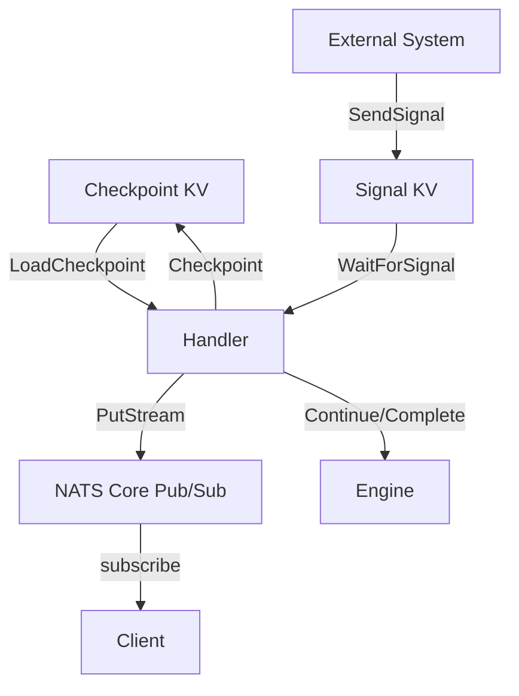

Context management is the strategy for maintaining, transmitting, and bounding conversation state across agent loop iterations, retries, and step boundaries.

## The Problem

LLM agents accumulate context over time: conversation messages, tool results, retrieved documents, intermediate reasoning. This context must survive across:

- **Iterations** in an agent loop (each `Continue()` re-enqueues the task)
- **Retries** after transient failures (network errors, rate limits)
- **Worker restarts** (the handler might execute on a different machine)

Without a strategy, context is lost on any of these events, forcing expensive replay of previous LLM calls.

## Checkpoints for Conversation State

[Checkpoints](/docs/coordination/checkpoints) are the primary mechanism for persisting context. Save the full conversation after each LLM call:

```go
w.Handle("agent", func(ctx worker.TaskContext) error {
    var conv Conversation
    if saved, _ := ctx.LoadCheckpoint(); saved != nil {
        json.Unmarshal(saved, &conv)
    } else {
        conv = newConversation(ctx.Input())
    }

    response, err := callLLM(conv.Messages)
    if err != nil {
        // Checkpoint is already saved from previous iteration.
        // Retry will resume from the last good state.
        return ctx.Fail(err)
    }
    conv.Messages = append(conv.Messages, response.Message)
    data, _ := json.Marshal(conv)
    ctx.Checkpoint(data)

    if response.Done {
        return ctx.Complete(extractResult(conv))
    }
    return ctx.Continue(nil)
})
```

The checkpoint saves **before** the decision to continue or complete. If the worker crashes after `Checkpoint()` but before `Continue()`, the retry loads the saved state and re-executes only the current decision, not the LLM call.

## Streaming for Real-Time Tokens

[Streaming](/docs/coordination/streaming) provides a parallel channel for live output. It does not replace checkpoints -- it complements them:

```go
// Stream tokens as they arrive (ephemeral, for live UX)
for token := range llmStream.Tokens() {
    ctx.PutStream([]byte(token))
    fullResponse.WriteString(token)
}
// Checkpoint the assembled response (durable, for recovery)
conv.Messages = append(conv.Messages, assistantMessage(fullResponse.String()))
ctx.Checkpoint(marshalConv(conv))
```

Streaming is fire-and-forget over core NATS. If no one is subscribed, tokens are lost. The checkpoint ensures the assembled response survives regardless.

## Signals for Injecting Context Mid-Execution

[Signals](/docs/coordination/signals) let external systems inject new context into a running agent:

```go
// Agent checks for injected context before each LLM call
signal, _ := ctx.WaitForSignal("context-update", 1*time.Second)
if signal != nil {
    var update ContextUpdate
    json.Unmarshal(signal, &update)
    conv.Messages = append(conv.Messages, userMessage(update.Content))
}
```

Short timeouts (1-5 seconds) let the agent check for updates without blocking. If no signal arrives, processing continues normally. This is useful for:

- Injecting new requirements discovered after the agent started
- Providing human feedback on intermediate results
- Updating configuration (model, temperature) mid-run

## Context Window Limits Across Retries

LLM context windows are finite. An agent loop that checkpoints the full conversation will eventually exceed the model's limit. Strategies:

**Truncation.** Drop old messages, keeping system prompt and recent history:

```go
func truncateConversation(msgs []Message, maxTokens int) []Message {
    if estimateTokens(msgs) <= maxTokens {
        return msgs
    }
    // Keep system prompt (first) and recent messages (last N)
    system := msgs[0]
    recent := msgs[len(msgs)-10:]
    return append([]Message{system}, recent...)
}
```

**Summarization.** Periodically summarize older context into a single message:

```go
if len(conv.Messages) > 20 && conv.Iteration%5 == 0 {
    summary, _ := callLLM(summarizePrompt(conv.Messages[:len(conv.Messages)-5]))
    conv.Messages = append(
        []Message{conv.Messages[0], assistantMessage(summary)},
        conv.Messages[len(conv.Messages)-5:]...,
    )
}
```

**External memory.** Store detailed context in NATS KV or an object store, and include only references in the conversation:

```go
// Store large tool results externally
key := fmt.Sprintf("%s.memory.%s", ctx.RunID(), toolCallID)
kv.Put(ctx, key, largeToolResult)
// Include a reference in the conversation
conv.Messages = append(conv.Messages, toolResultMessage(
    fmt.Sprintf("[Result stored at %s, %d bytes]", key, len(largeToolResult)),
))
```

## State Flow Summary



## Related

- [Checkpoints](/docs/coordination/checkpoints) -- KV storage API
- [Streaming](/docs/coordination/streaming) -- real-time pub/sub
- [Signals](/docs/coordination/signals) -- cross-step and external communication
- [Agent Loop Pattern](/docs/ai-patterns/agent-loop-pattern) -- the iteration cycle that needs context
