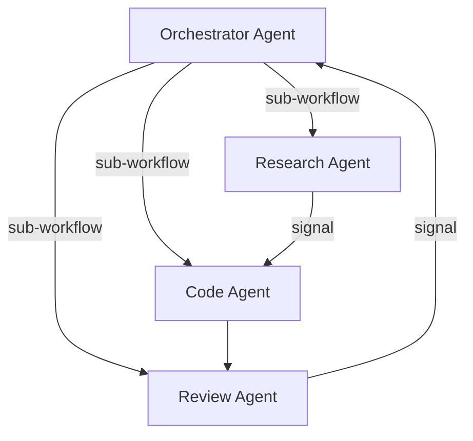

Multi-agent orchestration composes multiple LLM agents into a coordinated pipeline using sub-workflows for delegation, map steps for parallel fan-out, and signals for inter-agent communication.

## Topology



Each agent is a separate workflow with its own agent loop, checkpoints, and bounds. The orchestrator composes them using DagNats primitives rather than custom inter-process communication.

## Sub-Workflows as Agent Delegation

Each agent runs as an independent [sub-workflow](/docs/step-types/sub-workflows). The orchestrator's DAG references child workflows by name:

```go
wf := dag.NewWorkflow("multi-agent-pipeline")

research := wf.SubWorkflow("research", "research-agent").
    WithTimeout(10 * time.Minute)

code := wf.SubWorkflow("code", "code-agent").
    After(research).
    WithTimeout(15 * time.Minute)

review := wf.SubWorkflow("review", "review-agent").
    After(code).
    WithTimeout(5 * time.Minute)

def, _ := wf.Build()
```

Each child workflow is a full workflow definition with its own agent loop:

```go
researchWf := dag.NewWorkflow("research-agent")
researchWf.AgentLoop("loop", "research-llm").
    WithMaxIterations(10).
    WithMaxDuration(8 * time.Minute)
researchDef, _ := researchWf.Build()
```

The parent step blocks until the child completes. The child's output becomes the parent step's output, flowing to downstream dependencies. If a child agent fails, the parent step fails and the orchestrator's error handling applies.

## Map Steps for Parallel Agent Fan-Out

When the same agent task needs to run over multiple inputs, use [map steps](/docs/step-types/map-steps) to fan out:

```go
wf := dag.NewWorkflow("parallel-review")

// Split codebase into files
split := wf.Task("split", "split-files")

// Run review agent on each file in parallel
review := wf.Map("review-all", "review-single-file").
    After(split).
    WithMaxItems(50).
    WithTimeout(5 * time.Minute)

// Aggregate all reviews
merge := wf.Task("merge", "merge-reviews").
    After(review)

def, _ := wf.Build()
```

Each map instance can itself be a sub-workflow if the per-item processing is complex enough to warrant its own agent loop. The map step collects all outputs in array order for the downstream merge step.

## Signals for Inter-Agent Communication

Agents running concurrently can communicate via [signals](/docs/coordination/signals). This is useful when one agent discovers information that another needs:

```go
// Research agent sends findings as a signal
w.Handle("research-llm", func(ctx worker.TaskContext) error {
    // ... research logic ...
    if discovery.Relevant {
        ctx.SendSignal(parentRunID, "research-update", discoveryData)
    }
    return ctx.Continue(nil)
})

// Code agent checks for research updates
w.Handle("code-llm", func(ctx worker.TaskContext) error {
    update, _ := ctx.WaitForSignal("research-update", 5*time.Second)
    if update != nil {
        // Incorporate new information
        state.AddContext(update)
    }
    // ... coding logic ...
})
```

For cross-run signals, the sender needs the target run's ID. Pass it via step input or a shared KV key.

## Orchestrator as Planner

For dynamic multi-agent orchestration, combine the orchestrator with a [planner step](/docs/step-types/planner-steps). The orchestrator LLM decides which agents to invoke based on the task:

```go
wf := dag.NewWorkflow("dynamic-orchestrator")

analyze := wf.Task("analyze", "analyze-task")

plan := wf.Planner("plan", "orchestrate-agents", dag.PlannerConfig{
    MaxSteps:     10,
    AllowedTasks: []string{"research-agent", "code-agent", "review-agent"},
}).After(analyze)

report := wf.Task("report", "final-report").
    After(plan)

def, _ := wf.Build()
```

The planner handler prompts the LLM to produce a DAG fragment that wires together the appropriate agents with dependencies. The engine validates and executes the generated plan.

## Nesting Limits

Sub-workflow nesting is capped at **3 levels deep**. This means:

- Level 0: Orchestrator workflow
- Level 1: Agent sub-workflows
- Level 2: Agent-spawned sub-workflows
- Level 3: Maximum depth (rejected if exceeded)

Design your agent hierarchy to fit within this bound. If you need deeper composition, flatten by having agents communicate results via step output rather than spawning nested sub-workflows.

## Related

- [Sub-Workflows](/docs/step-types/sub-workflows) -- delegation mechanics
- [Map Steps](/docs/step-types/map-steps) -- parallel fan-out
- [Signals](/docs/coordination/signals) -- inter-agent communication
- [Planner Pattern](/docs/ai-patterns/planner-pattern) -- dynamic orchestration
- [Agent Loop Pattern](/docs/ai-patterns/agent-loop-pattern) -- the loop each agent runs
