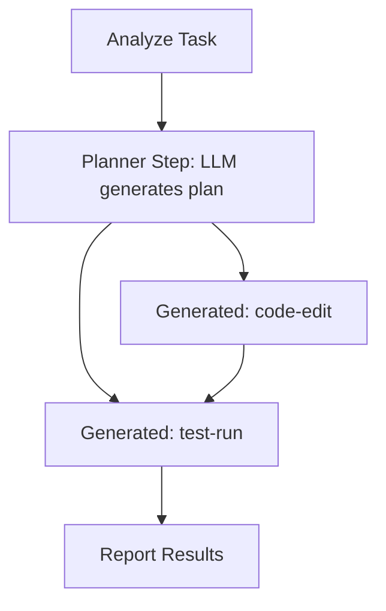

The planner pattern lets an LLM generate a DAG fragment at runtime, turning an AI's plan into executable workflow steps with safety constraints.

## How It Works

A [planner step](/docs/step-types/planner-steps) is a worker task whose output is not data -- it is a JSON DAG fragment. The engine validates the fragment against configurable bounds, namespaces the generated step IDs, and materializes them into the running workflow. From that point, the generated steps execute like any other.



This is the core mechanism for AI-planned workflows. The LLM analyzes a problem, decides what subtasks are needed, and emits structured JSON. The engine handles execution, retries, and dependency resolution.

## LLM Prompt Design

The planner worker prompts the LLM to produce a structured plan. The key is constraining the output format to match the engine's expected fragment schema:

```go
w.Handle("generate-plan", func(ctx worker.TaskContext) error {
    prompt := fmt.Sprintf(`Analyze this task and create an execution plan.

Available tools: code-edit, test-run, lint, search
Output a JSON plan with steps and dependencies.
Maximum %d steps. Each step needs an id, task, and optional depends_on.

Task: %s`, maxSteps, string(ctx.Input()))

    response, err := callLLMWithSchema(prompt, planSchema)
    if err != nil {
        return ctx.Fail(err)
    }
    return ctx.Complete([]byte(response))
})
```

The LLM should produce output like:

```json
{
  "steps": [
    {"id": "search", "task": "search", "input": {"query": "auth handler"}},
    {"id": "edit", "task": "code-edit", "depends_on": ["search"]},
    {"id": "test", "task": "test-run", "depends_on": ["edit"]},
    {"id": "lint", "task": "lint", "depends_on": ["edit"]}
  ]
}
```

## Schema Validation

The engine validates every fragment before materialization. This is your safety net against LLM hallucination:

| Check | What It Prevents |
|-------|-----------------|
| Step count bounds (1 to `MaxSteps`) | Unbounded step generation |
| Depth limit (`MaxDepth`) | Deeply chained dependencies |
| Cycle detection | Circular dependencies |
| ID collision check | Conflicts with static steps |
| `AllowedTasks` allowlist | Unauthorized task types |

If validation fails, the planner step fails and the engine's retry policy applies. The LLM gets another chance to produce a valid plan (if retries are configured).

## Workflow Definition

```go
wf := dag.NewWorkflow("ai-coding-agent")

analyze := wf.Task("analyze", "analyze-codebase").
    WithTimeout(30 * time.Second)

plan := wf.Planner("plan", "generate-plan", dag.PlannerConfig{
    MaxSteps:     20,
    MaxDepth:     5,
    AllowedTasks: []string{"code-edit", "test-run", "lint", "search"},
}).After(analyze)

report := wf.Task("report", "summarize-results").
    After(plan)

def, err := wf.Build()
```

The `AllowedTasks` list is critical for safety. Without it, an LLM could generate steps referencing any registered task type. With it, the engine rejects fragments containing unauthorized tasks.

## Safety Constraints

Plan generation has hard limits to prevent runaway execution:

| Constraint | Default | Maximum |
|-----------|---------|---------|
| Steps per planner | configured | 100 |
| Total dynamic steps per run | -- | 500 |
| Fragment depth | configured | 10 |

These limits mean that even if the LLM hallucinates an enormous plan, the engine rejects it before any generated step executes. The per-run limit of 500 dynamic steps prevents multiple planners from collectively overwhelming the system.

## Combining with Agent Loops

A powerful pattern: an agent loop decides **when** to plan, and a planner step decides **what** to execute.

```go
wf := dag.NewWorkflow("iterative-planner")

agent := wf.AgentLoop("agent", "reasoning-loop").
    WithMaxIterations(5).
    WithMaxDuration(30 * time.Minute)

// The agent loop handler can trigger planning by completing
// with a plan request, which feeds into a planner step
plan := wf.Planner("execute", "plan-and-run", dag.PlannerConfig{
    MaxSteps:     10,
    AllowedTasks: []string{"code-edit", "test-run"},
}).After(agent)
```

The agent loop handles the high-level reasoning. When it decides action is needed, it completes with context for the planner. The planner generates and executes the concrete steps.

## Related

- [Planner Steps](/docs/step-types/planner-steps) -- step type mechanics and configuration
- [Tool Use as Steps](/docs/ai-patterns/tool-use-as-steps) -- static tool-per-step alternative
- [Cost and Safety Controls](/docs/ai-patterns/cost-and-safety-controls) -- bounding generated work
- [Multi-Agent Orchestration](/docs/ai-patterns/multi-agent-orchestration) -- planners that delegate to sub-agents
