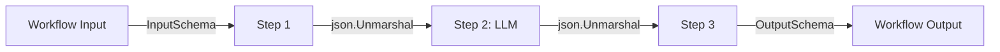

Typed schemas enforce structured input and output at workflow and step boundaries, catching malformed LLM responses before they propagate downstream.

## The Problem

LLM outputs are inherently unstructured. Even with structured output modes, models can produce unexpected formats, missing fields, or wrong types. Without validation, a malformed response from step 3 silently corrupts the input to step 7, and you debug for hours.

DagNats validates data at two levels: **workflow-level schemas** validate the initial input and final output of a run, and **handler-level typing** validates data at each step boundary within Go code.

## Workflow Input/Output Schemas

`WorkflowDef` supports `InputSchema` and `OutputSchema` fields for validating run-level data. The engine checks the workflow input against `InputSchema` before starting the run, and checks the final output against `OutputSchema` before marking the run as completed.

```go
wf := dag.NewWorkflow("code-review")

wf.SetInputSchema(map[string]any{
    "type": "object",
    "required": []string{"repo", "branch"},
    "properties": map[string]any{
        "repo":   map[string]any{"type": "string"},
        "branch": map[string]any{"type": "string"},
        "files":  map[string]any{
            "type":  "array",
            "items": map[string]any{"type": "string"},
        },
    },
})

wf.SetOutputSchema(map[string]any{
    "type": "object",
    "required": []string{"summary", "issues"},
    "properties": map[string]any{
        "summary": map[string]any{"type": "string"},
        "issues": map[string]any{
            "type":  "array",
            "items": map[string]any{"type": "object"},
        },
    },
})

def, err := wf.Build()
```

If the input fails validation, the run is rejected immediately. If the final output fails, the run fails with a schema validation error. This catches structural issues at the boundary, not deep in the pipeline.

## Typed Handlers for Structured LLM I/O

Within handlers, use Go structs to enforce types on step input and output:

```go
type ReviewInput struct {
    Repo   string   `json:"repo"`
    Branch string   `json:"branch"`
    Files  []string `json:"files"`
}

type ReviewOutput struct {
    Summary string  `json:"summary"`
    Issues  []Issue `json:"issues"`
    Score   float64 `json:"score"`
}

w.Handle("llm-review", func(ctx worker.TaskContext) error {
    var input ReviewInput
    if err := json.Unmarshal(ctx.Input(), &input); err != nil {
        return ctx.FailPermanent(
            fmt.Errorf("invalid input schema: %w", err),
        )
    }

    response, err := callLLMStructured(input)
    if err != nil {
        return ctx.Fail(err)
    }

    // Validate the LLM's response parses correctly
    var output ReviewOutput
    if err := json.Unmarshal(response, &output); err != nil {
        return ctx.Fail(
            fmt.Errorf("LLM response schema mismatch: %w", err),
        )
    }

    data, _ := json.Marshal(output)
    return ctx.Complete(data)
})
```

Two different failure modes: invalid **input** is `FailPermanent` (the upstream step produced bad data; retrying will not help). Invalid **LLM response** is `Fail` (the model might produce valid output on retry).

## Schema Generation from Go Types

For handlers that need to communicate their schema to the LLM (e.g., for structured output mode), derive the schema from the Go struct:

```go
type ToolCallSchema struct {
    Name      string         `json:"name"`
    Arguments map[string]any `json:"arguments"`
}

func schemaFromType(v any) map[string]any {
    // Reflect on struct fields to produce JSON Schema
    // This is a simplified example; real implementations
    // handle nested types, slices, and optionality.
    t := reflect.TypeOf(v)
    props := make(map[string]any)
    required := []string{}
    for i := 0; i < t.NumField(); i++ {
        field := t.Field(i)
        tag := field.Tag.Get("json")
        props[tag] = map[string]any{"type": goTypeToJSON(field.Type)}
        required = append(required, tag)
    }
    return map[string]any{
        "type":       "object",
        "properties": props,
        "required":   required,
    }
}
```

Pass the generated schema to the LLM's structured output parameter so the model knows exactly what format to produce. When the response comes back, `json.Unmarshal` into the same Go type validates it.

## Validation at Step Boundaries

Each step boundary is a validation point:



Data flows through the DAG as `[]byte`. Each handler deserializes its input, validates the structure, does its work, and serializes its output. The next handler deserializes and validates again. Malformed data fails at the first handler that touches it, with a clear error message identifying the schema mismatch.

## Related

- [Tool Use as Steps](/docs/ai-patterns/tool-use-as-steps) -- typed tool handlers
- [Planner Pattern](/docs/ai-patterns/planner-pattern) -- validating LLM-generated plans
- [Error Handling](/docs/reliability/error-handling) -- FailPermanent vs Fail for schema errors
