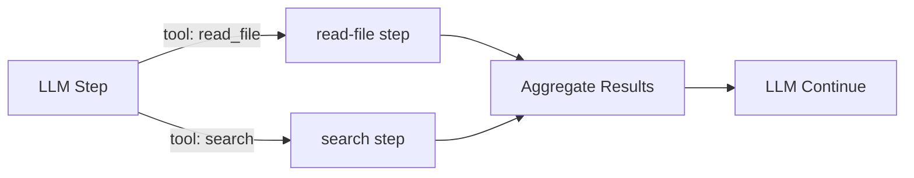

Modeling each LLM tool call as a separate DAG step gives you typed I/O, independent retries, parallel execution, and full observability per tool invocation.

## The Pattern

Instead of executing tools inline within an agent loop handler, define each tool as its own step type. An orchestrating step (or planner) wires them together as DAG dependencies. The LLM decides which tools to call; the DAG executes them with all the reliability guarantees of normal steps.



## Why Separate Steps

**Independent retries.** A file-read tool that hits a transient error retries on its own without re-running the LLM call that requested it. Each tool has its own [retry policy](/docs/reliability/retry-policies).

**Parallel execution.** When the LLM requests multiple tools simultaneously, [map steps](/docs/step-types/map-steps) fan them out across workers. No sequential bottleneck.

**Typed validation.** Each tool handler deserializes typed input and serializes typed output. Schema mismatches fail fast at the handler level, not buried in a string concatenation.

**Observability.** Each tool invocation is a separate trace span with its own duration, status, and error. You can see exactly which tool is slow or failing.

## Typed Tool Handlers

Define handlers that expect structured input and produce structured output:

```go
type ReadFileInput struct {
    Path string `json:"path"`
}
type ReadFileOutput struct {
    Content string `json:"content"`
    Size    int    `json:"size"`
}

w.Handle("read-file", func(ctx worker.TaskContext) error {
    var input ReadFileInput
    if err := json.Unmarshal(ctx.Input(), &input); err != nil {
        return ctx.FailPermanent(fmt.Errorf("invalid input: %w", err))
    }
    content, err := os.ReadFile(input.Path)
    if err != nil {
        return ctx.Fail(err)
    }
    output, _ := json.Marshal(ReadFileOutput{
        Content: string(content),
        Size:    len(content),
    })
    return ctx.Complete(output)
})
```

Invalid input is a `FailPermanent` -- no point retrying a malformed tool call. Transient errors (file system, network) use `Fail` for retry.

## Parallel Tool Calls via Map Steps

When an LLM returns multiple tool calls in a single response, model them as a map step. The orchestrator serializes the tool calls as a JSON array, and a map step fans out:

```go
wf := dag.NewWorkflow("multi-tool")

plan := wf.Task("plan", "llm-plan-tools")

execute := wf.Map("execute-tools", "dispatch-tool").
    After(plan).
    WithMaxItems(10).
    WithTimeout(30 * time.Second)

synthesize := wf.Task("synthesize", "llm-synthesize").
    After(execute)

def, _ := wf.Build()
```

The `dispatch-tool` handler inspects each item's `tool` field and delegates:

```go
w.Handle("dispatch-tool", func(ctx worker.TaskContext) error {
    var call ToolCall
    json.Unmarshal(ctx.Input(), &call)
    switch call.Name {
    case "read_file":
        return executeReadFile(ctx, call.Arguments)
    case "search":
        return executeSearch(ctx, call.Arguments)
    default:
        return ctx.FailPermanent(
            fmt.Errorf("unknown tool: %s", call.Name),
        )
    }
})
```

Each array element is processed independently and concurrently. The map step collects all outputs in order for the synthesis step.

## Tool Result Aggregation

The downstream step receives map outputs as a JSON array. The synthesizer formats them back into the LLM's expected tool-result format:

```go
w.Handle("llm-synthesize", func(ctx worker.TaskContext) error {
    var results []ToolResult
    json.Unmarshal(ctx.Input(), &results)
    messages := buildMessagesWithToolResults(results)
    response, err := callLLM(messages)
    if err != nil {
        return ctx.Fail(err)
    }
    return ctx.Complete([]byte(response.Content))
})
```

## When to Use This Pattern

| Scenario | Recommended Approach |
|----------|---------------------|
| Tools are fast and simple | Inline in agent loop handler |
| Tools are slow or unreliable | Separate steps with retries |
| LLM requests multiple tools at once | Map step for parallel execution |
| Tools need different timeout/retry configs | Separate steps |
| You need per-tool observability | Separate steps |

For simple agents with fast tools, inlining tool execution in the [agent loop handler](/docs/ai-patterns/agent-loop-pattern) is simpler. Break tools into steps when reliability or parallelism matters.

## Related

- [Map Steps](/docs/step-types/map-steps) -- parallel fan-out over arrays
- [Agent Loop Pattern](/docs/ai-patterns/agent-loop-pattern) -- inline tool execution alternative
- [Prompt and Response Schemas](/docs/ai-patterns/prompt-and-response-schemas) -- typed I/O validation
- [Planner Pattern](/docs/ai-patterns/planner-pattern) -- LLM decides which tools to wire together
