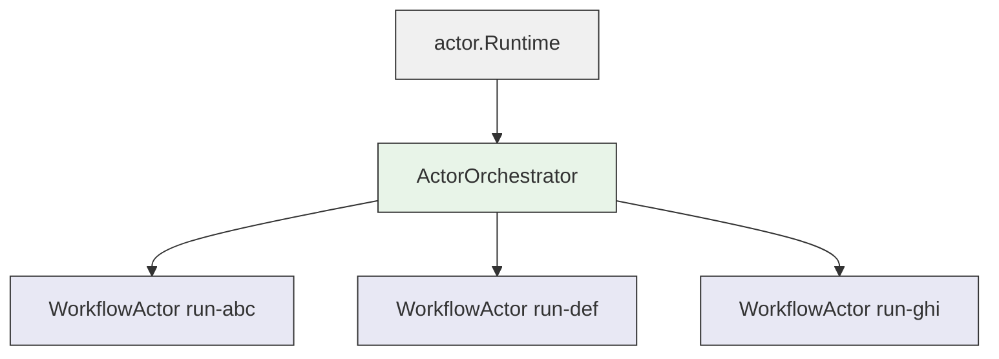

DagNats uses a lightweight actor runtime to manage per-workflow execution state with supervised concurrency.

## Why Actors

A workflow engine processes events for thousands of concurrent runs. Each run has its own state (step statuses, outputs, retry counts) that must be updated atomically. Two approaches handle this: locks or message passing.

DagNats chose message passing. Each workflow run gets its own **actor** -- a goroutine with a channel mailbox. Events for a run are delivered to its actor sequentially. No locks needed inside the actor. No data races between runs.

The actor model also provides **supervision** -- when an actor fails, its parent decides what to do (restart, stop, escalate). This eliminates manual error handling for transient failures in event processing.

## Core Types

The `actor/` package is pure Go with zero NATS dependencies. NATS integration lives in `engine/`.

### Address

Every actor has a unique address composed of a type and an ID:

```go
type Address struct {
    Type string // e.g. "workflow"
    ID   string // e.g. run ID
}
```

Addresses format as `{type}.{id}` for logging and map keys.

### Message

Messages are envelopes with a sender address and a payload:

```go
type Message struct {
    From    Address
    Payload any
}
```

The payload is untyped -- actors type-assert to the expected type in their `Receive` method.

### Actor Interface

Every actor implements a single method:

```go
type Actor interface {
    Receive(ctx *Context, msg Message) error
}
```

The runtime guarantees **sequential delivery**: one message at a time, in order. If `Receive` returns an error, the supervision strategy decides what happens next.

### Lifecycle Hooks

Actors that need startup or cleanup logic implement the optional `Lifecycle` interface:

```go
type Lifecycle interface {
    PreStart(ctx *Context) error
    PostStop(ctx *Context)
}
```

`PreStart` runs before the first message. Errors in `PreStart` trigger supervision (the actor never starts). `PostStop` runs after the actor stops -- errors are logged but not supervised.

### Context

The `Context` provides actor operations:

- **`Self()`** -- returns this actor's address
- **`Send(to, payload)`** -- delivers a message to another actor
- **`Spawn(addr, actor, opts...)`** -- creates a supervised child actor

## Actor Topology



The **Runtime** is the top-level container. The **ActorOrchestrator** subscribes to the `WORKFLOW_HISTORY` stream and routes events to per-run **WorkflowActors**. Each WorkflowActor holds its run state in memory and processes events sequentially.

## Runtime Mechanics

### Spawning

`Runtime.Spawn()` creates a root actor. `Context.Spawn()` creates a supervised child. Both allocate a buffered channel (default capacity: 64) and start a goroutine running the receive loop.

```go
rt := actor.NewRuntime()
rt.Spawn(
    actor.Address{Type: "workflow", ID: runID},
    workflowActor,
    actor.WithMailboxSize(128),
    actor.WithSupervision(&actor.OneForOne{}),
)
```

### Message Delivery

`Send()` writes to the target actor's channel. If the channel is full, it returns `ErrMailboxFull` immediately (non-blocking). If the target does not exist, it returns `ErrActorNotFound`.

### Sequential Processing

Each actor goroutine runs a select loop reading from its mailbox channel. One message is processed at a time. This eliminates concurrency bugs inside actors -- no mutexes, no race conditions on run state.

## Supervision

When an actor's `Receive` returns an error, the runtime consults the parent's **supervision strategy** to decide the response.

### Directives

| Directive | Behavior |
|-----------|----------|
| **Restart** | Stop the failed actor, re-enter its receive loop (same instance) |
| **Stop** | Terminate the actor permanently |
| **Escalate** | Stop the actor, then apply supervision to the parent |
| **Resume** | Ignore the error, re-enter the receive loop |

### Strategies

**OneForOne** (default): only the failed child restarts. Other siblings continue unaffected. This is the strategy used by the `ActorOrchestrator` -- a failure in one workflow run does not impact others.

```go
actor.WithSupervision(&actor.OneForOne{
    Decider: func(err error) actor.Directive {
        if isTransient(err) {
            return actor.Restart
        }
        return actor.Stop
    },
})
```

**AllForOne**: all siblings restart when any child fails. Useful when children have interdependent state (not currently used in DagNats).

### Restart Tracking

Each actor has a **RestartTracker** that allows at most 5 restarts within a 1-minute window. If an actor exceeds this budget, it is stopped permanently instead of restarted. This prevents infinite restart loops from consuming resources.

The tracker uses iterative pruning of expired timestamps -- no recursion, bounded memory.

## WorkflowActor

The `WorkflowActor` (`engine/workflow_actor.go`) implements `actor.Actor` for a single workflow run:

```go
type WorkflowActor struct {
    runID string
    def   *dag.WorkflowDef
    run   *dag.WorkflowRun
    store *SnapshotStore
    js    jetstream.JetStream
}
```

It holds the workflow definition and run state **in memory**. No per-event KV loads. The actor processes events by type:

| Event | Actor Behavior |
|-------|---------------|
| `workflow.started` | Parse definition, create run, enqueue ready steps |
| `step.completed` | Update step state, resolve next steps, check completion |
| `step.failed` | Increment attempts, apply retry policy, fail run if exhausted |
| `step.continue` | Increment iteration, check loop bounds, publish next task |

After each event, the actor snapshots to the `workflow_runs` KV bucket for durability. But the in-memory state is authoritative during the actor's lifetime.

## ActorOrchestrator

The `ActorOrchestrator` (`engine/actor_orch.go`) bridges NATS and the actor runtime:

1. Subscribes to `history.>` on the `WORKFLOW_HISTORY` stream with `DeliverAll` policy
2. Unmarshals each event and extracts the `runID`
3. Calls `ensureActor(runID)` -- spawns a `WorkflowActor` if one does not exist
4. Routes the event to the actor via `runtime.Send()`
5. Acknowledges the NATS message

If sending to the actor fails (mailbox full, actor not found), the NATS message is NAK'd with a 5-second delay for retry.

```go
func (ao *ActorOrchestrator) ensureActor(runID string) {
    if _, loaded := ao.actors.Load(runID); loaded {
        return
    }
    wa := NewWorkflowActor(runID, ao.store, ao.js)
    addr := actor.Address{Type: "workflow", ID: runID}
    ao.rt.Spawn(addr, wa, actor.WithSupervision(&actor.OneForOne{}))
    ao.actors.Store(runID, wa)
}
```

Actor spawning is idempotent. If two events for the same run arrive concurrently, the second `Spawn` call returns `ErrAlreadyExists` and is silently ignored.
