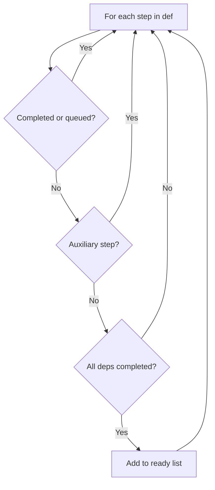

The DAG resolution algorithm is a pure function that determines which steps to execute next based on the current state of a workflow run.

## The Core Function

`dag.ResolveReady()` takes a workflow definition, a set of completed step IDs, and a set of queued step IDs. It returns the list of steps whose dependencies are satisfied and that have not already been dispatched.

```go
func ResolveReady(
    def WorkflowDef,
    completed map[string]bool,
    queued map[string]bool,
) []StepDef
```

This function is **pure** -- no I/O, no side effects, no NATS. Given the same inputs, it always returns the same outputs. This makes it trivially testable and safe to call from any context.

### Resolution Logic

For each step in the definition:

1. **Skip if already done**: if the step is in `completed` or `queued`, skip it
2. **Skip auxiliary steps**: steps marked as auxiliary (on-failure handlers, compensation targets) are never resolved through normal dependency resolution -- the engine dispatches them directly when their trigger fires
3. **Check dependencies**: if every step in `DependsOn` appears in `completed`, the step is ready

Steps with no dependencies (entry points) are always ready on the first call.



### No Recursion

The algorithm iterates over the flat step list once. Dependency checking is a linear scan of each step's `DependsOn` slice against the `completed` map. There is no recursive graph traversal. The step list in `WorkflowDef` is topologically sorted at build time, so iteration order naturally respects the DAG structure.

## Related Functions

### ResolveSkipped

```go
func ResolveSkipped(def, completed, queued, steps) []StepDef
```

Returns steps whose dependencies are satisfied **and** whose `SkipIf` condition evaluates to true. The orchestrator marks these as `Skipped` instead of enqueuing them. Skipped steps count as completed for downstream resolution -- their dependents can proceed.

### ResolveInput

```go
func ResolveInput(step StepDef, steps map[string]StepState) ([]byte, error)
```

Builds the input payload for a step from upstream outputs:

| Upstream Count | Input |
|---------------|-------|
| 0 (entry step) | `nil` -- receives workflow-level input from the caller |
| 1 | Pass-through -- the upstream step's output verbatim |
| N (fan-in) | JSON map of `{depID: output}` so the handler can address each upstream |

### IsComplete

```go
func IsComplete(def WorkflowDef, completed map[string]bool) bool
```

Returns true when every non-auxiliary step is completed or skipped. Auxiliary steps that were never triggered (the happy path) do not block completion.

### ResolveCompensateChain

```go
func ResolveCompensateChain(def, completed, failedStepID) []StepDef
```

When a step fails and the workflow has compensation steps defined, this function builds the compensation chain. It collects completed steps that have a `Compensate` target, reverses them (last completed first), and wires `DependsOn` between them for sequential execution.

## How the Engine Calls Resolution

The `WorkflowActor` calls resolution functions after each event. The pattern repeats for every event type:

```mermaid
sequenceDiagram
    participant Stream as WORKFLOW_HISTORY
    participant Actor as WorkflowActor
    participant DAG as dag package
    participant Tasks as TASK_QUEUES

    Stream->>Actor: step.completed event
    Actor->>Actor: update step state in memory
    Actor->>DAG: ResolveReady(def, completed, queued)
    DAG-->>Actor: []StepDef (ready steps)
    Actor->>DAG: ResolveInput(step, states)
    DAG-->>Actor: input payload
    Actor->>Tasks: publish task for each ready step
    Actor->>Actor: snapshot to KV
```

1. **Event arrives**: the actor updates the in-memory `WorkflowRun` struct
2. **Resolve ready steps**: call `ResolveReady()` with current completed and queued sets
3. **Resolve input**: for each ready step, call `ResolveInput()` to build its input from upstream outputs
4. **Publish tasks**: publish task messages to `TASK_QUEUES` at subject `task.{taskType}`
5. **Check completion**: call `IsComplete()` to see if the workflow is done
6. **Snapshot**: save the updated run state to the `workflow_runs` KV bucket

This cycle drives the entire workflow forward. Each event potentially unlocks new steps, which produce new events when they complete, which unlock more steps. The DAG structure ensures forward progress without cycles.

## Action Types

When the engine processes ready steps, it translates them into actions based on the step type:

| Step Type | Action |
|-----------|--------|
| Normal | Publish task to `task.{taskType}` |
| AgentLoop | Publish task with iteration metadata |
| SubWorkflow | Publish `workflow.spawn` event |
| Map | Publish one task per input item (atomic batch) |
| Sleep | Publish to `SLEEP_TIMERS` (no task) |
| WaitForEvent | Register waiter in `event_waiters` KV |
| Approval | Generate token, store in `approval_tokens` KV |
| Planner | Publish task, then materialize returned DAG fragment |

Normal task dispatch is the common case. Special step types have dedicated handling in the engine but still use the same resolution algorithm to determine when they are ready.

## Determinism

The resolution algorithm is deterministic: same definition + same completed set + same queued set = same ready steps. This property is critical for:

- **Testing**: pure functions are trivially unit-testable without NATS
- **Replay**: rebuilding state from the event log produces identical results
- **Debugging**: given the event history, you can reproduce the exact sequence of resolution decisions

The `dag/` package has zero I/O dependencies. All NATS interaction happens in `engine/`, which calls into `dag/` for the pure computation and handles the I/O side effects itself.
