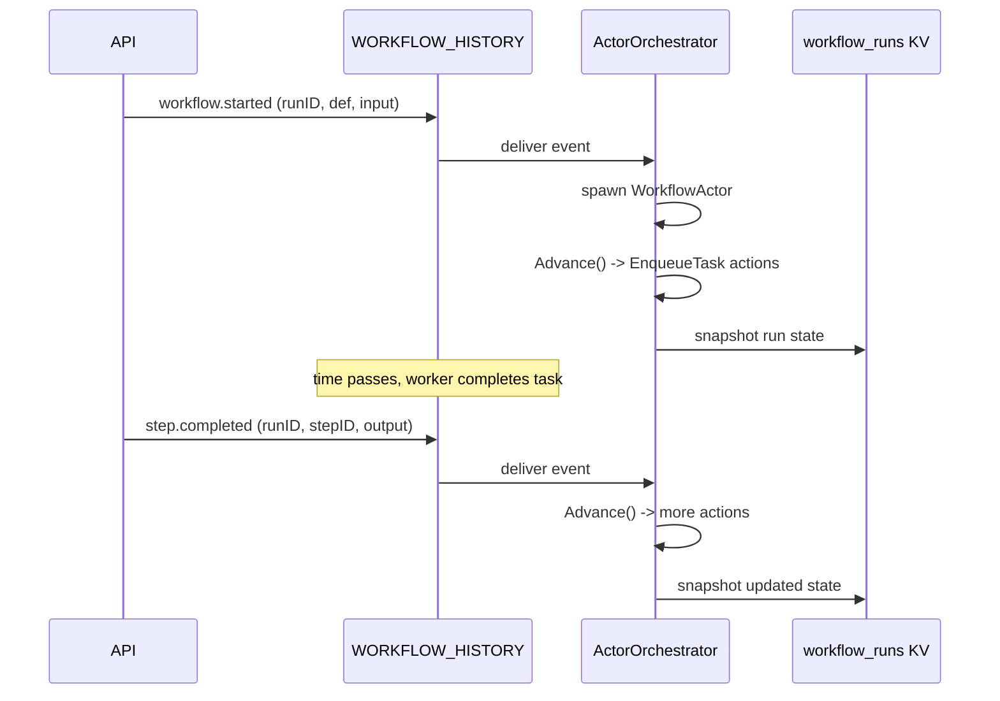
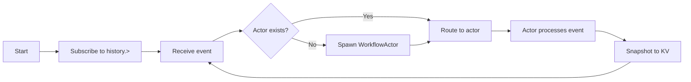

DagNats uses event sourcing as its persistence model -- the WORKFLOW_HISTORY stream is the single source of truth for all workflow state.

## Why Event Sourcing

Traditional workflow engines store mutable rows: update the step status, overwrite the output, increment the retry counter. This makes debugging hard (what happened between states?), recovery fragile (what if the update was partial?), and auditing impossible (who changed what when?).

Event sourcing stores **what happened** as an immutable, append-only log. Current state is derived by replaying events from the beginning. Every state transition is recorded. Nothing is lost. Nothing is overwritten.

For a workflow engine, this is a natural fit. A workflow run *is* a sequence of events: started, step completed, step failed, workflow completed. Storing those events directly means the log is both the operational data and the audit trail.

## The Event Log

Every state change publishes an immutable event to the `WORKFLOW_HISTORY` JetStream stream at subject `history.{runID}`.

### Event Types

The system defines these event types, each carrying a typed payload:

| Event | Published When |
|-------|---------------|
| `workflow.started` | API starts a new run |
| `workflow.completed` | All steps completed |
| `workflow.failed` | Step failure exhausted retries |
| `workflow.cancelled` | Run cancelled via API |
| `workflow.spawn` | Sub-workflow launched |
| `workflow.child.completed` | Child workflow finished |
| `workflow.child.failed` | Child workflow failed |
| `step.completed` | Worker reports success |
| `step.failed` | Worker reports failure |
| `step.cancelled` | Step cancelled |
| `step.continue` | Agent loop iteration |
| `step.sleep.started` | Sleep step begins |
| `step.sleep.completed` | Sleep duration elapsed |
| `step.wait.started` | Wait-for-event step begins |
| `step.wait.matched` | External event matched |
| `step.wait.timeout` | Wait timed out |
| `step.map.started` | Map fan-out begins |
| `step.map.completed` | All map instances done |
| `step.map.instance.completed` | One map instance done |
| `agent.loop.iteration` | Agent loop progress |
| `compensate.started` | Compensation chain begins |
| `compensate.step.completed` | Compensation step done |
| `compensate.failed` | Compensation failed |
| `compensate.completed` | All compensation done |

## Deduplication

Every event published to `WORKFLOW_HISTORY` includes a `Nats-Msg-Id` header. NATS uses a 5-second dedup window to reject duplicate publishes. This means the engine can safely retry event publishing without risk of double-processing.

The dedup ID is typically `{runID}.{eventType}.{stepID}` or `{runID}.{eventType}` for workflow-level events. This makes each event naturally idempotent.

## KV Snapshots

The `workflow_runs` KV bucket stores **snapshots** of run state. These are a convenience for fast reads -- not the source of truth.

The snapshot contains the current `WorkflowRun` struct: run status, step states, outputs, error messages, timing data. The engine updates the snapshot after processing each event.

**Snapshots exist for two reasons:**

1. **Fast reads**: the API can serve `GET /runs/{id}` by reading the KV entry directly, without replaying the event stream
2. **Recovery hint**: on startup, the orchestrator can load the last snapshot as a starting point, then replay only events published after the snapshot's sequence number

If a snapshot is lost or corrupt, the engine rebuilds it from the event log. The event log is always correct.

## Replay Semantics

On startup, the `ActorOrchestrator` creates a JetStream consumer with `DeliverAll` policy on `history.>`. It processes every event from the beginning of the stream.

For each event:
1. The orchestrator ensures a `WorkflowActor` exists for that `runID`
2. The event is routed to the actor's mailbox
3. The actor updates its in-memory state
4. The actor snapshots to KV

This replay is idempotent. Processing the same event twice produces the same state because each event is a deterministic state transition. The `Nats-Msg-Id` dedup prevents duplicate events from entering the stream in the first place.

## Stateless Orchestrator

The orchestrator holds no persistent state of its own. All state lives either in the event stream or in per-run actor memory (which is rebuilt from the stream on startup). This means:

- **Restarts are safe**: kill the process, start it again, state recovers from the event log
- **No migration**: there is no database schema to migrate
- **No coordination**: multiple orchestrator instances reading the same stream would process the same events (though DagNats runs a single orchestrator by design)

## Trade-offs

Event sourcing is not free:

- **Storage grows over time**: every event is kept. Set `MaxAge` or `MaxBytes` on `WORKFLOW_HISTORY` when runs older than your recovery window are no longer needed.
- **Replay time on startup**: proportional to total events. For very large deployments, snapshots reduce the effective replay window.
- **Event schema evolution**: changing event payloads requires backward compatibility. DagNats handles this by keeping payloads as `json.RawMessage` and parsing defensively.

For a workflow engine, these trade-offs are strongly favorable. The audit trail, debuggability, and recovery guarantees far outweigh the storage cost.
