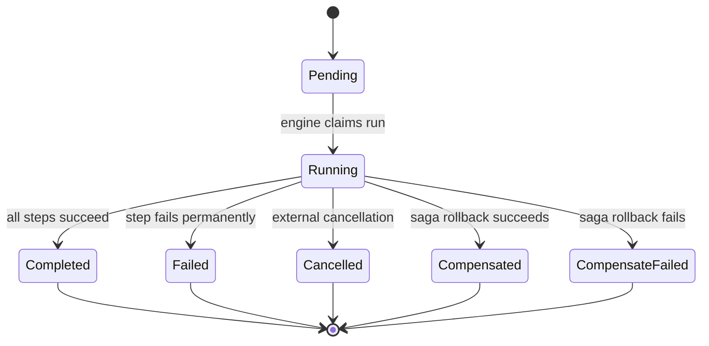

A **run** is a single execution of a workflow definition -- it tracks the live state of every step from creation to terminal status.

## WorkflowRun

When you start a workflow, the engine creates a `WorkflowRun` with all steps initialized to `pending`. The run holds mutable state that evolves as events arrive.

Key fields:

| Field | Type | Purpose |
|-------|------|---------|
| `RunID` | `string` | Unique execution identifier |
| `WorkflowID` | `string` | Name of the workflow definition |
| `Status` | `RunStatus` | Current lifecycle state |
| `Steps` | `map[string]StepState` | Per-step mutable state |
| `Input` | `json.RawMessage` | Original user-supplied payload |
| `CreatedAt` | `time.Time` | When the run was created (UTC) |
| `ParentRunID` | `string` | Set for child sub-workflow runs |
| `Deadline` | `*time.Time` | Workflow-level timeout deadline |

## Run Status State Machine

A run progresses through these states:



| Status | Meaning |
|--------|---------|
| `pending` | Created but not yet claimed by the engine |
| `running` | Engine is actively scheduling steps |
| `completed` | All non-auxiliary steps finished successfully |
| `failed` | A step failed permanently (retries exhausted, no compensation) |
| `cancelled` | Cancelled via API, CLI, or `CancelOn` event |
| `compensated` | Failed but saga compensation succeeded |
| `compensate_failed` | Compensation itself failed |

All statuses except `pending` and `running` are **terminal** -- once reached, the run never changes state again.

## Step Status States

Each step within a run has its own status:

| Status | Meaning |
|--------|---------|
| `pending` | Not yet ready (dependencies unsatisfied) |
| `queued` | Dispatched to NATS, waiting for a worker |
| `running` | Worker is executing the task |
| `completed` | Finished successfully with output |
| `failed` | Failed permanently |
| `skipped` | Bypassed via `SkipIf` condition |
| `cancelled` | Run was cancelled while step was in progress |
| `recovered` | Failed but recovered via OnFailure handler |

## Input and Output

**Run input** is an arbitrary JSON payload supplied when starting the workflow. It is preserved on the `WorkflowRun` so retries can reuse it. Steps with no dependencies receive the run input as their task input.

**Step output** is stored as raw bytes on `StepState.Output`. Downstream steps receive the output of their dependencies as input. For steps with multiple dependencies, the engine assembles a merged input payload.

## Starting a Run

Via CLI:

```bash
dagnats run start my-workflow '{"key": "value"}'
```

Via API:

```go
runID, err := svc.StartRun(ctx, "my-workflow", inputJSON)
```

## Inspecting a Run

```bash
dagnats run get <run-id>
dagnats run list --workflow=my-workflow --status=running
```

The `get` command shows the run status, each step's status, and timing information. The `list` command filters runs by workflow name, status, and time range.

## Cancelling a Run

```bash
dagnats run cancel <run-id>
```

Cancellation transitions the run to `cancelled` and terminates any in-flight steps. Steps that have already completed retain their output. Steps that are `pending` or `queued` are moved to `cancelled` without execution.

Workflows can also self-cancel via the `CancelOn` builder option, which watches for a matching external event.

## Related pages

- [Workflows and DAGs](/docs/concepts/workflows-and-dags) -- defining what a run executes
- [Events and Event Sourcing](/docs/concepts/events-and-event-sourcing) -- how run state changes are recorded
- [Workers](/docs/concepts/workers) -- what executes the steps in a run
