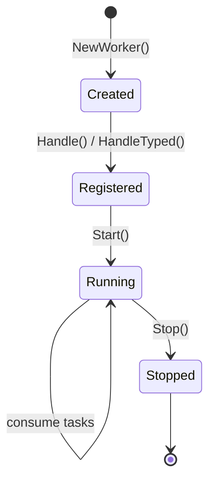

A **worker** is a process that subscribes to NATS task subjects, executes handler functions, and publishes completion events back to the engine.

## Lifecycle

Workers follow a strict lifecycle: create, register handlers, start, consume tasks, stop.



**Create** allocates the worker and binds it to a NATS connection. **Register** maps task type strings to handler functions. **Start** creates JetStream pull consumers for each registered task type and begins consuming. **Stop** unsubscribes all consumers and deregisters from the worker directory.

## Creating a Worker

`worker.NewWorker()` takes a NATS connection, an optional telemetry bundle, and variadic options:

```go
w := worker.NewWorker(nc, nil) // nil tel = noop telemetry
```

Options include:

| Option | Purpose |
|--------|---------|
| `WithGroups(groups...)` | Subscribe only to specific worker groups |
| `WithPartitions(n)` | Enable elastic consumer groups with n partitions |

## Registering Handlers

Two registration patterns:

### Handle (raw bytes)

`Handle()` registers a `HandlerFunc` that receives a `TaskContext` with raw `[]byte` input. The handler calls exactly one terminal method per execution.

```go
w.Handle("fetch", func(ctx worker.TaskContext) error {
    data := fetchFromAPI(ctx.Input())
    return ctx.Complete(data)
})
```

### HandleTyped (generics)

`HandleTyped[I, O]()` wraps a typed handler function. JSON marshal/unmarshal is handled automatically. Serialization failures are non-retriable.

```go
worker.HandleTyped(w, "transform", func(
    ctx worker.TaskContext, input TransformInput,
) (TransformOutput, error) {
    result := transform(input)
    return result, nil
})
```

The typed handler calls `Complete()` automatically on success -- you return the output value and error, not call `Complete()` yourself.

### HandleSingleton

`HandleSingleton()` registers a handler that runs as a single-partition elastic consumer group. Only one consumer processes messages at a time across all worker instances. Useful for ordered processing or exclusive resource access.

## TaskContext Interface

Every handler receives a `TaskContext` -- the deep interface that hides all NATS mechanics behind clean method calls.

### Identity and input

| Method | Returns | Purpose |
|--------|---------|---------|
| `Input()` | `[]byte` | Raw task input payload |
| `RunID()` | `string` | Workflow run identifier |
| `StepID()` | `string` | Step identifier within the run |
| `RetryCount()` | `int` | Current attempt number (0-based) |

### Step completion

Call exactly one of these per execution:

| Method | Purpose |
|--------|---------|
| `Complete(output)` | Mark step as succeeded with output |
| `Fail(err)` | Mark as retriable failure (retries apply) |
| `FailPermanent(err)` | Mark as non-retriable failure (skip all retries) |
| `FailRetryAfter(err, d)` | Fail with explicit retry delay, bypassing backoff |
| `Continue(output)` | Agent loop: signal another iteration |

### Streaming and heartbeat

| Method | Purpose |
|--------|---------|
| `PutStream(data)` | Publish data to `stream.{runID}.{stepID}` via core NATS (ephemeral, fire-and-forget) |
| `Heartbeat()` | Extend AckWait timer to prevent redelivery during long work |

### Checkpointing

| Method | Purpose |
|--------|---------|
| `Checkpoint(state)` | Save arbitrary state to KV at `{runID}.{stepID}` |
| `LoadCheckpoint()` | Retrieve saved state (returns `nil, nil` if none exists) |
| `Pause(name, d)` | Checkpoint + NakWithDelay for mid-task durable delay |

### Signals

| Method | Purpose |
|--------|---------|
| `WaitForSignal(name, timeout)` | Block until KV key `{runID}.{name}` is written (max 1 hour) |
| `SendSignal(runID, name, data)` | Write to KV to wake a waiting step |

## Graceful Shutdown

`Stop()` unsubscribes all JetStream consumers, stops the heartbeat goroutine, and deregisters from the worker directory KV bucket. In-flight tasks that have not yet called a terminal method will be redelivered by JetStream's `MaxDeliver` policy after `AckWait` expires.

```go
w.Start()
defer w.Stop()

// Block until shutdown signal
sig := make(chan os.Signal, 1)
signal.Notify(sig, syscall.SIGINT, syscall.SIGTERM)
<-sig
```

## Related pages

- [Steps](/docs/concepts/steps) -- what workers execute
- [Runs](/docs/concepts/runs) -- the execution context workers operate within
- [Events and Event Sourcing](/docs/concepts/events-and-event-sourcing) -- what happens after a worker completes
