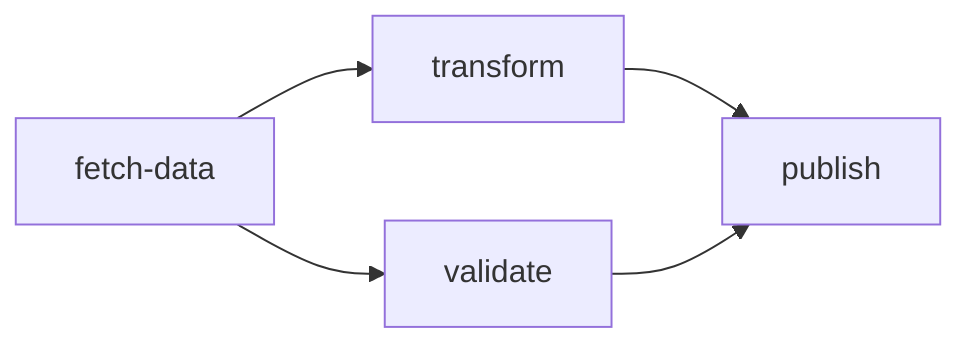

A **workflow** is a directed acyclic graph (DAG) of steps that DagNats executes with dependency-aware scheduling.

## WorkflowDef

Every workflow starts as a `WorkflowDef` -- an immutable schema stored in the `workflow_defs` KV bucket. A definition declares the graph topology (steps and their dependencies), version string, and optional constraints like concurrency limits and timeouts. Once stored, a definition can be executed many times as independent [runs](/docs/concepts/runs).

Key fields on `WorkflowDef`:

| Field | Type | Purpose |
|-------|------|---------|
| `Name` | `string` | Unique identifier for the workflow |
| `Version` | `string` | Schema version (defaults to `"1"`) |
| `Steps` | `[]StepDef` | Ordered list of step definitions |
| `Concurrency` | `*ConcurrencyLimit` | Max parallel runs and steps |
| `Timeout` | `time.Duration` | Workflow-level deadline |
| `Sticky` | `StickyStrategy` | Worker affinity (`soft` or `hard`) |
| `Singleton` | `*SingletonConfig` | One-at-a-time constraint |

## DAG Structure

Steps form a DAG through their `DependsOn` fields. A step with no dependencies starts immediately when the run begins. A step with dependencies waits until all listed predecessors complete. The engine resolves the graph iteratively -- steps at the same depth execute in parallel.



In this graph, `fetch-data` runs first. Once it completes, `transform` and `validate` run in parallel. `publish` waits for both to finish.

## Builder API

`dag.NewWorkflow()` returns a fluent builder for constructing workflow definitions. The builder returns `StepRef` handles for compile-time-safe dependency wiring -- no string typos, no silent miswiring.

```go
wf := dag.NewWorkflow("data-pipeline").Version("2")

fetch := wf.Task("fetch-data", "fetch")
transform := wf.Task("transform", "transform").After(fetch)
validate := wf.Task("validate", "validate").After(fetch)
publish := wf.Task("publish", "publish").After(transform, validate).
    WithTimeout(30 * time.Second).
    WithRetries(3)

def, err := wf.Build()
```

`Build()` assembles the `WorkflowDef` and calls `Validate()` internally. Any structural error -- cycles, missing dependencies, invalid config -- surfaces as a clean error value rather than a runtime panic.

### Workflow-level options

Chain these on the builder before calling `Build()`:

| Method | Purpose |
|--------|---------|
| `Version(v)` | Override the default `"1"` version string |
| `WithConcurrency(maxRuns, maxSteps)` | Bound parallel runs and in-flight steps |
| `WithSticky(strategy)` | Worker affinity (`soft` prefers, `hard` requires) |
| `WithIdempotencyKey(dotPath)` | Dedup runs by input field |
| `WithSingleton(mode)` | One-at-a-time (`skip` or `cancel` duplicates) |
| `WithPriority(cfg)` | Priority-based run ordering |
| `CancelOn(event, match)` | Cancel on external event |

## Validation

`dag.Validate()` checks a `WorkflowDef` for structural correctness before any run is created. Catching errors at definition time defines them out of existence at runtime -- the engine safely assumes every definition it receives has already passed validation.

Validate checks for:

- **Unique step IDs** -- no duplicates
- **Valid dependencies** -- every `DependsOn` reference points to an existing step
- **No cycles** -- uses iterative Kahn's algorithm (no recursion)
- **Type-specific config** -- AgentLoop has `MaxIterations > 0`, Map has exactly one dependency, etc.
- **Concurrency bounds** -- `MaxSteps` in `[0, 1000]`
- **Aux target constraints** -- OnFailure/Compensate targets have no dependencies and don't self-reference

## Versioning

The `Version` field on `WorkflowDef` enables schema evolution. Existing runs continue executing against the definition version they were started with. New runs pick up the latest version stored in KV. The `workflow_defs` KV bucket preserves revision history, so you can inspect previous versions.

## Related pages

- [Steps](/docs/concepts/steps) -- what goes inside a workflow
- [Runs](/docs/concepts/runs) -- executing a workflow definition
- [Step Types](/docs/step-types/) -- detailed reference for each step type
