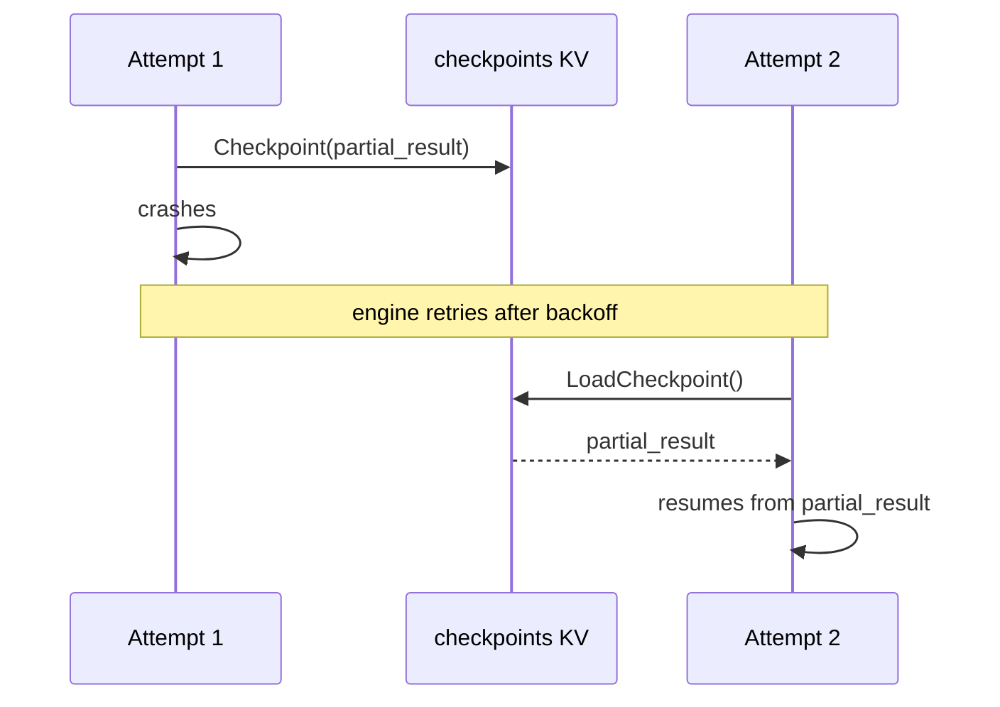

Checkpoints persist arbitrary handler state to NATS KV, enabling recovery across retries, redeliveries, and agent loop iterations.

## Overview

When a step handler crashes, times out, or calls `Continue()` in an agent loop, the engine re-enqueues the task. Without checkpoints, the handler restarts from scratch every time. The **checkpoints** KV bucket gives handlers a key-value store to save and restore state at `{runID}.{stepID}`.

Checkpoints are especially important for LLM agent loops where conversation history accumulates over many iterations. Losing that history means replaying expensive API calls. With `Checkpoint()` and `LoadCheckpoint()`, the handler saves its conversation state after each LLM call and restores it on the next iteration or retry.

## API

### Checkpoint

Saves state to KV. Overwrites any previous value for this step.

```go
w.Handle("summarize", func(ctx worker.TaskContext) error {
    partial, _ := ctx.LoadCheckpoint()
    result, err := processChunk(ctx.Input(), partial)
    if err != nil {
        return ctx.Fail(err)
    }
    if err := ctx.Checkpoint(result.State); err != nil {
        return ctx.Fail(err)
    }
    return ctx.Complete(result.Output)
})
```

### LoadCheckpoint

Retrieves the last saved state. Returns `(nil, nil)` if no checkpoint exists or the KV bucket is not configured.

```go
w.Handle("agent-step", func(ctx worker.TaskContext) error {
    state, err := ctx.LoadCheckpoint()
    if err != nil {
        return ctx.Fail(err)
    }
    if state == nil {
        state = ctx.Input() // first execution
    }
    // ... continue from saved state
})
```

### Pause and Resume

`Pause()` combines a checkpoint with a NAK-with-delay, creating a clean pause/resume pattern without involving the engine. The step stays in `Running` status while the NATS message is redelivered after the delay.

```go
w.Handle("rate-limited", func(ctx worker.TaskContext) error {
    state, _ := ctx.LoadCheckpoint()
    if isPauseResume(state) {
        state = extractResumeState(state)
    }
    result, err := callAPI(state)
    if err != nil && isRateLimited(err) {
        return ctx.Pause("rate-limit", 30*time.Second)
    }
    return ctx.Complete(result)
})
```

Under the hood, `Pause()` writes a JSON checkpoint with a `{"pause_resume": "name"}` marker, then calls `msg.NakWithDelay(duration)`. On the next delivery, `LoadCheckpoint()` returns the marker so the handler knows it is resuming from a pause.

## Persistence Across Retries

When a step fails and the engine retries it (via [retry policy](/docs/reliability/retry-policies)), the checkpoint from the previous attempt is still in KV. The new attempt can load it and skip already-completed work:



This is critical for idempotent processing. If a step processes 100 items and crashes at item 73, the retry can checkpoint the list of completed items and skip them.

## Storage Details

| Property | Value |
|----------|-------|
| KV bucket | `checkpoints` |
| Key format | `{runID}.{stepID}` |
| Value | arbitrary bytes (handler-defined) |
| TTL | configured on the bucket (recommended: match run retention) |
| Max value size | NATS KV default (typically 1MB) |

The `checkpoints` bucket is optional. If it was not created during `natsutil.SetupAll`, `Checkpoint()` returns an error and `LoadCheckpoint()` returns `(nil, nil)`. This means handlers that do not need checkpoints work without any KV setup.

## LLM Pattern: Checkpointing Conversation History

An agent loop handler saves the full conversation after each LLM call:

```go
w.Handle("llm-agent", func(ctx worker.TaskContext) error {
    var messages []Message
    saved, _ := ctx.LoadCheckpoint()
    if saved != nil {
        json.Unmarshal(saved, &messages)
    } else {
        messages = []Message{{Role: "user", Content: string(ctx.Input())}}
    }
    response, err := callLLM(messages)
    if err != nil {
        return ctx.Fail(err)
    }
    messages = append(messages, response.Message)
    data, _ := json.Marshal(messages)
    ctx.Checkpoint(data)
    if response.Done {
        return ctx.Complete([]byte(response.FinalAnswer))
    }
    return ctx.Continue(nil)
})
```

Each iteration adds to the conversation. If the worker crashes mid-iteration, the retry loads the last checkpoint and re-does only the current LLM call, not the entire conversation.

## Related

- [Signals](/docs/coordination/signals) -- cross-step communication via KV watches
- [Streaming](/docs/coordination/streaming) -- real-time output during execution
- [Agent Loops](/docs/step-types/agent-loops) -- iterative steps that rely on checkpoints
- [Retry Policies](/docs/reliability/retry-policies) -- when checkpoints matter most
