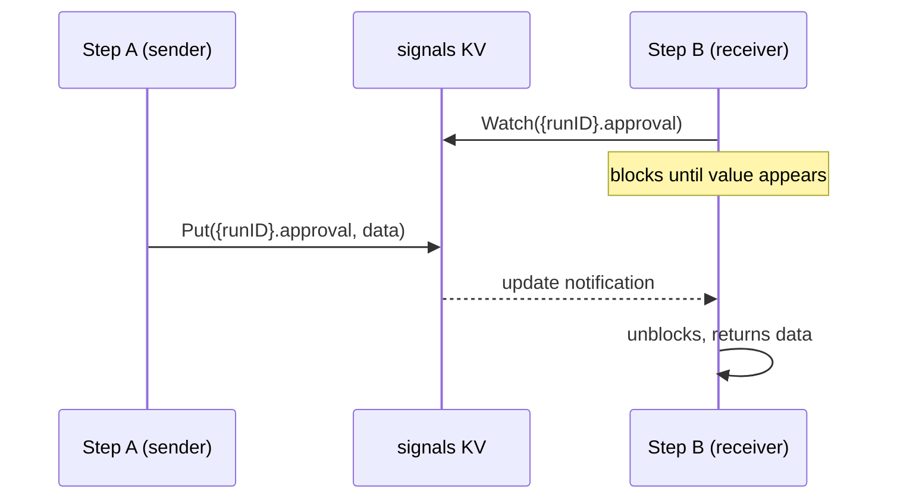

Signals enable real-time communication between steps or across workflow runs using NATS KV watches.

## Overview

Steps sometimes need to wait for input that arrives asynchronously -- a human approval, another step's side effect, or an event from an external system. The **signals** KV bucket provides a publish/subscribe mechanism scoped to workflow runs. A sender writes a value to a KV key, and a receiver watches that key. The moment the value appears, the watcher unblocks.

Unlike [Wait for Event](/docs/step-types/wait-for-event) steps (which are a step type), signals operate **within** a running step's handler. A step calls `WaitForSignal()` and blocks in-process until the signal arrives or the timeout fires. Another step (in the same run or a different one) calls `SendSignal()` to write the value. The NATS KV watch delivers the update immediately.

Signals are keyed as `{runID}.{name}` in the `signals` KV bucket. The run ID scoping means you can use the same signal name across different runs without collision.

## Signal Flow



## API

### WaitForSignal

Blocks the current step until a named signal is written or the timeout expires.

```go
w.Handle("wait-for-review", func(ctx worker.TaskContext) error {
    data, err := ctx.WaitForSignal("review-done", 30*time.Minute)
    if err != nil {
        return ctx.Fail(err) // timeout or KV error
    }
    return ctx.Complete(data)
})
```

The timeout is capped at **1 hour** by the implementation. If the timeout expires before a signal arrives, `WaitForSignal` returns an error with the message `signal "name" timed out after duration`.

**While waiting**, the step's NATS message remains in-flight. For long waits, call `Heartbeat()` periodically to prevent AckWait redelivery, or use `Pause()` to NAK with delay and resume on the next delivery.

### SendSignal

Writes data to a signal key, waking any watcher on that key.

```go
w.Handle("submit-review", func(ctx worker.TaskContext) error {
    feedback := []byte(`{"approved": true, "comment": "LGTM"}`)
    err := ctx.SendSignal(ctx.RunID(), "review-done", feedback)
    if err != nil {
        return ctx.Fail(err)
    }
    return ctx.Complete(feedback)
})
```

`SendSignal` accepts an explicit `runID` parameter, enabling **cross-run communication**. A step in run A can send a signal to run B if it knows run B's ID.

### Cross-Step Example

A two-step workflow where one step blocks until the other signals:

```go
wf := dag.NewWorkflow("feedback-loop")
process := wf.Task("process", "process-data")
review := wf.Task("review", "wait-for-review")
def, _ := wf.Build()
```

The steps run concurrently (no dependency edge). The `wait-for-review` handler blocks on `WaitForSignal`, and the `process-data` handler calls `SendSignal` when it needs the reviewer to unblock.

## Timeout Behavior

| Condition | Result |
|-----------|--------|
| Signal arrives before timeout | Returns `(data, nil)` |
| Timeout expires first | Returns `(nil, error)` with timeout message |
| Signal KV not configured | Returns `(nil, error)` immediately |
| Context cancelled | Depends on KV watcher; may return update or block until timeout |

The maximum allowed timeout is **1 hour**. Passing a value outside `(0, 1h]` causes a panic -- this is a programmer error, not a runtime condition.

## LLM Pattern: Injecting User Feedback into Running Agents

An [agent loop](/docs/step-types/agent-loops) can pause mid-execution and wait for human input before continuing:

```go
w.Handle("llm-agent", func(ctx worker.TaskContext) error {
    history, _ := ctx.LoadCheckpoint()
    result, _ := callLLM(history)
    if result.NeedsFeedback {
        ctx.Checkpoint(result.FullHistory)
        ctx.PutStream([]byte("Waiting for user feedback..."))
        feedback, err := ctx.WaitForSignal("user-feedback", 30*time.Minute)
        if err != nil {
            return ctx.Fail(err)
        }
        result.FullHistory = appendFeedback(result.FullHistory, feedback)
        ctx.Checkpoint(result.FullHistory)
        return ctx.Continue(feedback)
    }
    return ctx.Complete(result.Summary)
})
```

An external system (CLI, API, UI) sends the feedback via the API, which internally calls `SendSignal(runID, "user-feedback", data)`.

## Related

- [Checkpoints](/docs/coordination/checkpoints) -- persisting state across retries and iterations
- [Streaming](/docs/coordination/streaming) -- real-time output to clients
- [Approval Gates](/docs/step-types/approval-gates) -- signal-based human approval as a step type
- [Wait for Event](/docs/step-types/wait-for-event) -- engine-level event correlation
