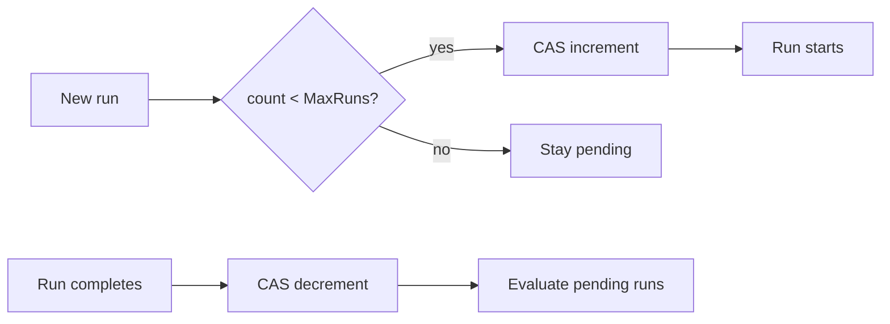

Concurrency limits control how many workflow runs and steps execute in parallel, preventing resource exhaustion and upstream overload.

## ConcurrencyLimit Configuration

The `ConcurrencyLimit` struct on `WorkflowDef` provides two scopes:

| Field | JSON Key | Type | Description |
|-------|----------|------|-------------|
| **MaxRuns** | `max_runs` | `int` | Max parallel runs of this workflow (0 = unlimited) |
| **MaxSteps** | `max_steps` | `int` | Max parallel steps within a single run (0 = unlimited) |

```go
wf := dag.NewWorkflow("code-review").
    WithConcurrency(3, 2)

def, _ := wf.Build()
// def.Concurrency.MaxRuns == 3
// def.Concurrency.MaxSteps == 2
```

## Per-Workflow Run Limits (MaxRuns)

`MaxRuns` caps how many runs of the same workflow execute simultaneously. When a new run starts and the limit is reached, the run remains in `pending` status until an active run completes.

### Implementation

Run counts are tracked in the `concurrency_runs` KV bucket using **compare-and-swap (CAS)** operations for atomic updates. The engine increments the counter when a run starts and decrements it when a run reaches a terminal state.



CAS retries are bounded at **10 attempts** to prevent infinite loops under contention. If all attempts fail, the run stays pending and is re-evaluated on the next engine tick.

### Pending Run Priority

When a slot opens, the engine selects the **oldest pending run** (by creation time) to maintain FIFO ordering. The `PriorityConfig` can adjust this ordering -- see [Priority](/docs/flow-control/priority).

## Per-Run Step Limits (MaxSteps)

`MaxSteps` limits how many steps within a single run execute concurrently. When the DAG has more ready steps than the limit allows, the engine queues the excess steps and dispatches them as running steps complete.

This is enforced in the `enqueueReady` path -- the engine counts in-flight steps and only dispatches up to the remaining budget.

## Per-Task-Type Limits

Beyond workflow-level limits, individual steps can cap global concurrency for their task type:

```go
callLLM := wf.Task("call-llm", "llm.chat").
    WithTimeout(60 * time.Second).
    WithTaskConcurrency(5)
```

This means at most 5 `llm.chat` tasks run across **all workflows** simultaneously. The counter lives in the `concurrency_tasks` KV bucket. If the limit is reached, the task is retried via `SLEEP_TIMERS` with a 1-second delay.

**Bounds:** 1-1000 per scope.

## JSON Schema Example

```json
{
  "name": "deploy-pipeline",
  "version": "1",
  "concurrency": {
    "max_runs": 1,
    "max_steps": 3
  },
  "steps": [
    {
      "id": "build",
      "task": "build",
      "timeout": "10m",
      "type": "normal",
      "max_task_concurrency": 2
    }
  ]
}
```

## Related Pages

- [Rate Limiting](/docs/flow-control/rate-limiting) -- request-rate throttling
- [Priority](/docs/flow-control/priority) -- ordering pending runs
- [Retry Policies](/docs/reliability/retry-policies) -- retry behavior when concurrency-delayed
