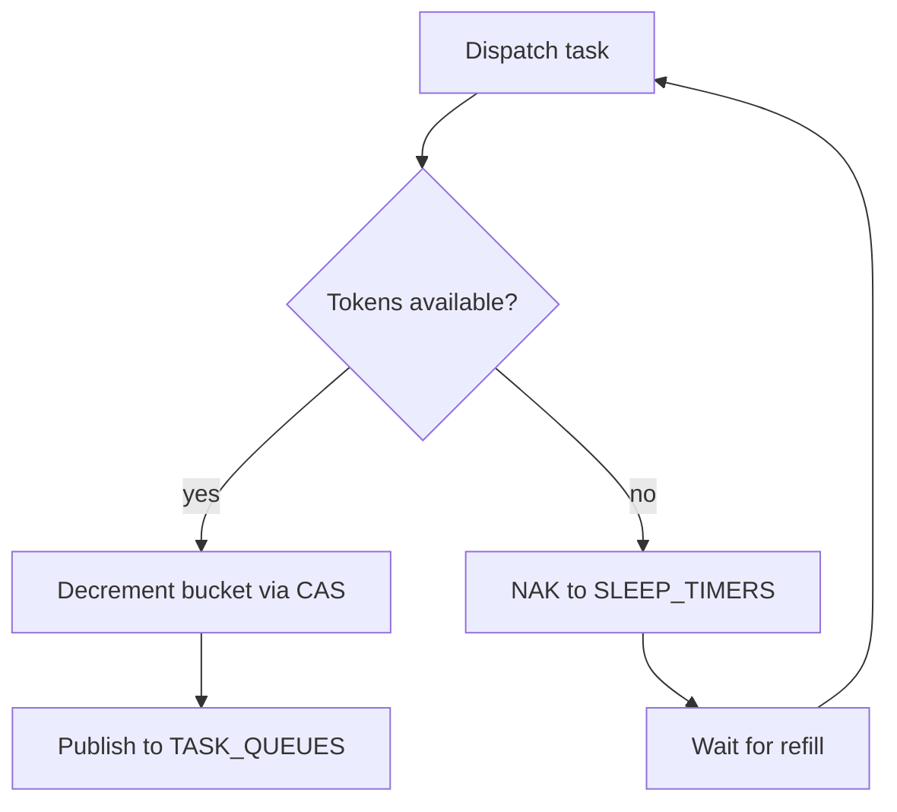

Rate limiting controls how frequently tasks of a given type are dispatched, using a KV-backed token bucket that works across all workflow runs.

## Two Scopes

DagNats supports **global** and **keyed** rate limits. Global limits apply to all invocations of a task type. Keyed limits partition the budget by a value extracted from the task input.

### Global Rate Limit

```go
callLLM := wf.Task("call-llm", "llm.chat").
    WithTimeout(60 * time.Second).
    WithRateLimit(dag.RateLimit{
        Limit:  10,
        Period: 1 * time.Minute,
    })
```

This allows at most 10 `llm.chat` dispatches per minute across all runs.

| Field | Type | Description |
|-------|------|-------------|
| **Limit** | `int` | Max tokens (dispatches) per period; must be positive |
| **Period** | `duration` | Time window for token refill; must be positive |

### Keyed Rate Limit

```go
callProvider := wf.Task("call-provider", "llm.chat").
    WithTimeout(60 * time.Second).
    WithKeyedRateLimit(dag.KeyedRateLimit{
        Key:    "provider",
        Limit:  100,
        Period: 1 * time.Minute,
        Units:  1,
    })
```

This maintains a **separate** token bucket for each distinct `provider` value in the task input. If one run's input has `{"provider": "openai"}` and another has `{"provider": "anthropic"}`, they consume from independent buckets.

| Field | Type | Description |
|-------|------|-------------|
| **Key** | `string` | Dot-path into task input for bucket partitioning |
| **Limit** | `int` | Max tokens per period per key; must be positive |
| **Period** | `duration` | Refill window; must be positive |
| **Units** | `int` | Tokens consumed per dispatch; must be positive |

The `Key` field supports dot-path expressions (e.g., `config.provider.name`) using the same `ExtractDotPath` function as idempotency keys.

## Token Bucket Implementation

Rate limits are stored in the `rate_limits` KV bucket. Each bucket entry tracks the current token count and last-refill timestamp.

- **Global key format:** `{taskType}._global`
- **Per-key format:** `{taskType}.{keyValue}`

The check happens in the **task dispatch path**. When a task is about to be published to `TASK_QUEUES`:

1. Engine reads the token bucket from KV
2. If tokens are available, decrement and dispatch
3. If exhausted, NAK via `SLEEP_TIMERS` with a `rate_retry` action

The `rate_retry` timer re-publishes the task after the refill delay, at which point the check runs again.



### CAS Contention

Token bucket updates use **compare-and-swap** bounded at 10 retries. KV entries auto-expire at **2x the rate period** to prevent stale state accumulation.

## Validation Rules

- A step cannot have both `RateLimit` and `KeyedRateLimit` set simultaneously
- `Limit` must be positive
- `Period` must be positive
- For keyed limits, `Key` must be non-empty and `Units` must be positive


**Respecting provider rate limits.** When calling LLM APIs, set the rate limit to match your provider's documented limits minus a safety margin. For example, if your OpenAI tier allows 60 RPM, set `Limit: 50, Period: 1 * time.Minute` to leave headroom for other consumers.


## Related Pages

- [Concurrency Limits](/docs/flow-control/concurrency-limits) -- parallel execution caps
- [Retry Policies](/docs/reliability/retry-policies) -- retry behavior for rate-limited tasks
- [Idempotency](/docs/reliability/idempotency) -- safe replay after rate-limit delays
