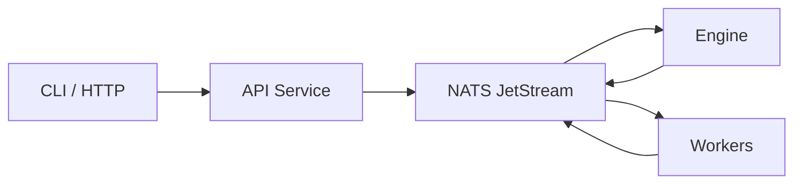

DagNats is a DAG-based workflow engine built on NATS JetStream for orchestrating durable workflows and autonomous LLM coding pipelines.

## The Problem

Multi-step workflows -- deploy pipelines, code review bots, data processing chains -- need retries, timeouts, dependency ordering, and observability. Building this on top of a message broker means writing a custom orchestrator. Building it on top of a database means polling, locking, and operational overhead.

Most workflow engines require external databases (Postgres, Redis, MySQL) alongside a separate message broker. This creates deployment complexity, operational burden, and failure modes that have nothing to do with your actual workflows.

## What DagNats Does

DagNats combines the **workflow engine** and the **message broker** into a single system by building directly on **NATS JetStream**. You define workflows as directed acyclic graphs (DAGs) in JSON, register them with the server, and write workers that handle individual steps. The engine resolves dependencies, dispatches tasks, handles retries, and tracks state -- all through NATS primitives.

The core execution model is **event sourcing**. Every state change is an immutable event on a JetStream stream. The engine is stateless: it replays the event log to reconstruct workflow state. There is no mutable database row to corrupt or lose.

## Key Differentiators

- **Single binary** -- `dagnats serve` starts an embedded NATS server, the workflow engine, the API, and an HTTP gateway. No external dependencies to install or manage.
- **No external database** -- JetStream provides streams, key-value stores, and object storage. All state lives in NATS.
- **Event-sourced** -- Immutable event log is the source of truth. KV snapshots are a convenience, not authoritative.
- **NATS-native** -- Retries use `NakWithDelay`, timeouts use `AckWait`, signals use KV watches, dedup uses `Nats-Msg-Id`. No custom infrastructure.
- **Agent loops as a primitive** -- Built-in `agent_loop` step type for iterative LLM agent execution with bounded iterations and duration.

## Architecture Overview

The **CLI** and **HTTP clients** send commands to the **API service**, which writes to NATS. The **engine** watches the event stream, resolves the DAG, and dispatches tasks. **Workers** pull tasks from NATS, execute them, and publish results back. All communication flows through NATS -- no direct connections between components.

## When to Use DagNats

| Use Case | DagNats? | Why |
|----------|----------|-----|
| Multi-step workflows with dependencies | Yes | DAG resolution, retries, timeouts built in |
| LLM agent pipelines | Yes | Native agent loops, checkpointing, streaming |
| Single-binary deployment | Yes | No Postgres, no Redis, no Kafka |
| Simple cron jobs | No | Use cron or systemd timers |
| High-throughput data pipelines | No | Use Apache Beam, Flink, or Spark |
| Long-running human workflows | Maybe | Approval gates exist, but Temporal is more mature here |

### DagNats vs Temporal

Temporal requires a database cluster (Cassandra or Postgres) and a separate frontend service. DagNats runs as a single binary with zero external dependencies. Temporal has a richer SDK ecosystem and production track record. Choose DagNats when you want simplicity and NATS-native infrastructure.

### DagNats vs Airflow

Airflow is built for scheduled batch data pipelines with a Python-first SDK. DagNats is built for event-driven workflows with a Go SDK. Airflow requires Postgres and a scheduler process. DagNats requires nothing beyond its own binary.

## Non-Goals

DagNats is **not** a general-purpose job queue. It does not replace Redis-backed workers for simple fire-and-forget tasks.

DagNats is **not** a data pipeline framework. It does not handle backpressure, windowing, or large-scale data shuffling. Use purpose-built tools like Apache Beam for that.

DagNats is **not** a workflow-as-code SDK. Workflows are defined in JSON, not in Go code. This is deliberate: JSON definitions can be validated, versioned, and visualized without executing code.

## Next Steps

- [Quickstart](/docs/get-started/quickstart) -- zero to running in five minutes
- [Core Concepts](/docs/concepts) -- workflows, steps, events, and the DAG model
- [Architecture](/docs/architecture) -- deep dive into the engine and NATS primitives
