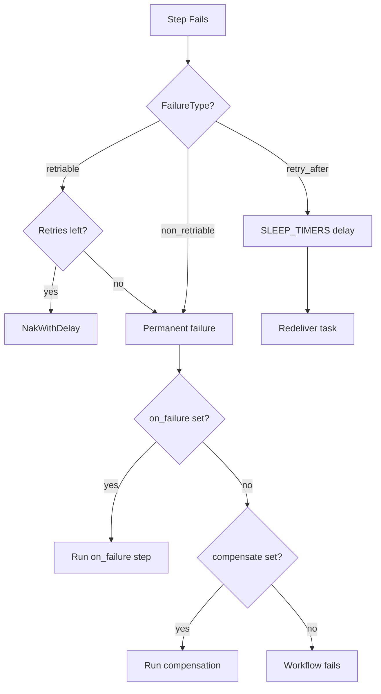

DagNats provides structured error handling with three failure types, on-failure handlers, and saga compensation -- giving workers precise control over how the engine responds to failures.

## FailureType

Every step failure carries a `FailureType` that tells the engine what to do next:

| Type | Wire Value | Engine Behavior |
|------|-----------|-----------------|
| **Retriable** | `retriable` | Apply retry policy (default) |
| **Non-retriable** | `non_retriable` | Skip retries, go to on-failure/compensation/fail |
| **Retry-after** | `retry_after` | Schedule exact delay via `SLEEP_TIMERS`, bypass backoff |

The default is `retriable` -- if a worker calls `Fail()` without specifying a type, the engine applies the step's retry policy normally. Old-format error payloads (plain strings) are also treated as retriable for backward compatibility.

## Worker Failure Methods

Workers signal failures through three methods on `TaskContext`:

```go
w.Handle("process", func(ctx worker.TaskContext) {
    result, err := doWork(ctx.Input())
    if err != nil {
        switch {
        case isInvalidInput(err):
            // No point retrying -- input won't change
            ctx.FailPermanent(err)
        case isRateLimited(err):
            // Provider said wait 30s
            ctx.FailRetryAfter(err, 30*time.Second)
        default:
            // Transient error -- use normal retry policy
            ctx.Fail(err)
        }
        return
    }
    ctx.Complete(result)
})
```

| Method | FailureType | Use Case |
|--------|-------------|----------|
| `Fail(err)` | `retriable` | Transient errors (network, timeouts, 5xx) |
| `FailPermanent(err)` | `non_retriable` | Permanent errors (bad input, 4xx, business logic) |
| `FailRetryAfter(err, d)` | `retry_after` | Caller-specified delay (rate limits, circuit breakers) |

`FailRetryAfter` delay is clamped to [100ms, 1 hour]. The engine schedules the retry via `SLEEP_TIMERS` with a `TimerActionRetryAfter`, bypassing the normal backoff calculation entirely.

## Failure Flow



## On-Failure Handlers

The `on_failure` field on a step definition names another step to run when the primary step fails permanently. The failure handler receives the original step's error in its input.

```go
wf := dag.NewWorkflow("payment")

charge := wf.Task("charge", "stripe.charge").
    WithTimeout(30 * time.Second).
    WithOnFailure("notify-failure")

notify := wf.Task("notify-failure", "slack.post").
    WithTimeout(10 * time.Second)
```

On-failure steps are declared as **auxiliary steps** -- they do not participate in the normal DAG flow and are only executed when their associated step fails.

## Saga Compensation

The `compensate` field names a step that undoes the work of a completed step when a downstream failure requires rollback. Compensation runs in reverse topological order.

```go
wf := dag.NewWorkflow("order")

reserve := wf.Task("reserve", "inventory.reserve").
    WithTimeout(30 * time.Second).
    WithCompensation("release")

charge := wf.Task("charge", "payment.charge").
    After(reserve).
    WithTimeout(30 * time.Second)

release := wf.Task("release", "inventory.release").
    WithTimeout(30 * time.Second)
```

If `charge` fails permanently, the engine runs `release` to undo the inventory reservation. The run status transitions to `compensated` on success or `compensate_failed` if compensation itself fails.

## Related Pages

- [Retry Policies](/docs/reliability/retry-policies) -- backoff strategies and configuration
- [Dead Letter Queue](/docs/reliability/dead-letter-queue) -- where permanently failed tasks go
- [Cancellation](/docs/reliability/cancellation) -- cancelling in-flight work
