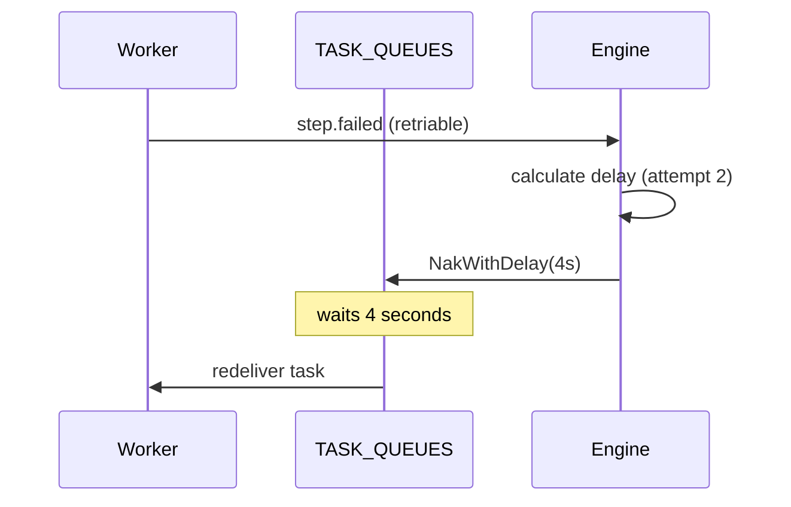

A **retry policy** defines how DagNats handles transient step failures -- how many times to retry, how long to wait between attempts, and which backoff strategy to use.

## RetryPolicy Configuration

| Field | JSON Key | Type | Description |
|-------|----------|------|-------------|
| **MaxAttempts** | `max_attempts` | `int` | Total retry attempts; 0 means no retries |
| **Strategy** | `strategy` | `RetryStrategy` | Backoff algorithm: `fixed`, `linear`, or `exponential` |
| **InitialDelay** | `initial_delay` | `duration` | Base delay between attempts |
| **MaxDelay** | `max_delay` | `duration` | Delay cap (0 = uncapped) |
| **Multiplier** | `multiplier` | `float64` | Multiplier for `exponential` strategy only |

## Backoff Strategies

DagNats supports three backoff strategies, each computing the delay before the next retry attempt (1-based):

| Strategy | Formula | Example (initial: 2s) |
|----------|---------|----------------------|
| `fixed` | `initial_delay` | 2s, 2s, 2s, 2s |
| `linear` | `initial_delay * attempt` | 2s, 4s, 6s, 8s |
| `exponential` | `initial_delay * multiplier^(attempt-1)` | 2s, 4s, 8s, 16s |

All strategies respect **MaxDelay** -- if the computed delay exceeds the cap, MaxDelay is used instead.

## Setting Retry Policies

### Per-Step (Builder API)

```go
wf := dag.NewWorkflow("llm-pipeline")

callLLM := wf.Task("call-llm", "llm.chat").
    WithTimeout(60 * time.Second).
    WithRetryPolicy(dag.RetryPolicy{
        MaxAttempts:  5,
        Strategy:     dag.RetryExponential,
        InitialDelay: 2 * time.Second,
        MaxDelay:     30 * time.Second,
        Multiplier:   2.0,
    })
```

### Workflow Default

Set a default retry policy that applies to all steps unless overridden:

```go
wf := dag.NewWorkflow("data-pipeline").
    WithDefaultRetry(dag.RetryPolicy{
        MaxAttempts:  3,
        Strategy:     dag.RetryFixed,
        InitialDelay: 5 * time.Second,
        MaxDelay:     5 * time.Second,
    })
```

### Resolution Order

The engine resolves the effective retry policy for each step using this precedence:

1. Step-level `Retry` field (highest priority)
2. Workflow-level `DefaultRetry`
3. Legacy `Retries` field (converted to fixed-delay policy with 5s delay)
4. No retries (if none of the above are set)

## NATS Implementation

Retries use NATS **NakWithDelay** -- the engine NAKs the failed task message with the computed delay. NATS redelivers the message after the delay expires. This eliminates the need for a separate timer service or retry queue.



## Non-Retryable Errors

Workers can signal that a failure should **not** be retried by calling `FailPermanent()`:

```go
w.Handle("validate", func(ctx worker.TaskContext) {
    input := ctx.Input()
    if !isValid(input) {
        ctx.FailPermanent(fmt.Errorf("invalid input: %s", input))
        return
    }
    ctx.Complete(map[string]any{"valid": true})
})
```

`FailPermanent()` sets the failure type to `non_retriable`, causing the engine to skip all remaining retries and immediately proceed to on-failure handling or workflow failure.

See [Error Handling](/docs/reliability/error-handling) for the full `FailureType` taxonomy.


**Retrying transient LLM API failures.** LLM providers frequently return 429 (rate limit) and 503 (overloaded) errors. Use `exponential` backoff with a generous `max_delay` (30-60s) and 5+ max attempts to ride out transient API unavailability without manual intervention.


## Related Pages

- [Error Handling](/docs/reliability/error-handling) -- failure types and on-failure handlers
- [Timeouts](/docs/reliability/timeouts) -- per-step and per-workflow deadlines
- [Rate Limiting](/docs/flow-control/rate-limiting) -- preventing upstream overload
