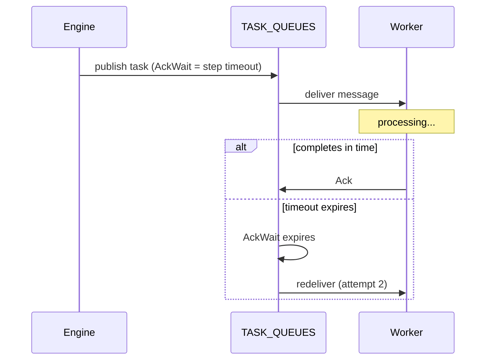

Every step in DagNats **requires** a timeout -- there are no unbounded executions.

## Per-Step Timeout

The `Timeout` field on `StepDef` is mandatory. It sets the maximum wall-clock time a worker has to complete the step before the engine considers it failed.

```go
wf := dag.NewWorkflow("data-pipeline")

fetch := wf.Task("fetch", "http-fetch").
    WithTimeout(30 * time.Second)

transform := wf.Task("transform", "process").
    After(fetch).
    WithTimeout(5 * time.Minute)
```

If a worker does not resolve a task within the timeout, NATS **AckWait** expires and the message is redelivered (up to **MaxDeliver** times). This is the primary timeout enforcement mechanism -- no application-level timer is needed.

### How AckWait Enforces Timeouts



Workers can extend the deadline mid-execution by calling `Heartbeat()`, which sends an `InProgress()` signal to NATS to reset the AckWait timer:

```go
w.Handle("long-task", func(ctx worker.TaskContext) {
    for i := 0; i < 100; i++ {
        processChunk(i)
        ctx.Heartbeat() // reset AckWait
    }
    ctx.Complete(map[string]any{"chunks": 100})
})
```

## Per-Workflow Timeout

The optional `Timeout` field on `WorkflowDef` sets an overall deadline for the entire run. When set, the engine computes a `Deadline` on the `WorkflowRun` at creation time.

```go
wf := dag.NewWorkflow("bounded-pipeline").
    WithTimeout(30 * time.Minute)
```

If the run has not reached a terminal state by the deadline, the engine cancels all in-flight steps and marks the run as `failed`. The workflow timeout acts as a safety net -- individual step timeouts handle the common case, but the workflow timeout catches pathological scenarios like cascading retries.

## Timeout Guidance

| Scenario | Recommended Timeout |
|----------|-------------------|
| HTTP API call | 10-60s |
| LLM inference | 60-300s |
| File processing | 1-10m |
| Agent loop (total) | 10-30m |
| End-to-end pipeline | 30-120m |

Set step timeouts based on the **worst-case expected duration** plus headroom for retries. The workflow timeout should exceed the sum of the critical path's step timeouts.

## Validation

The workflow validator enforces that every step has a non-zero `Timeout`. Calling `Build()` on a workflow with a missing timeout returns an error. This is a deliberate design choice -- unbounded execution is a reliability hazard in production systems.

## Related Pages

- [Retry Policies](/docs/reliability/retry-policies) -- what happens after a timeout
- [Error Handling](/docs/reliability/error-handling) -- failure semantics
- [Cancellation](/docs/reliability/cancellation) -- manual termination
