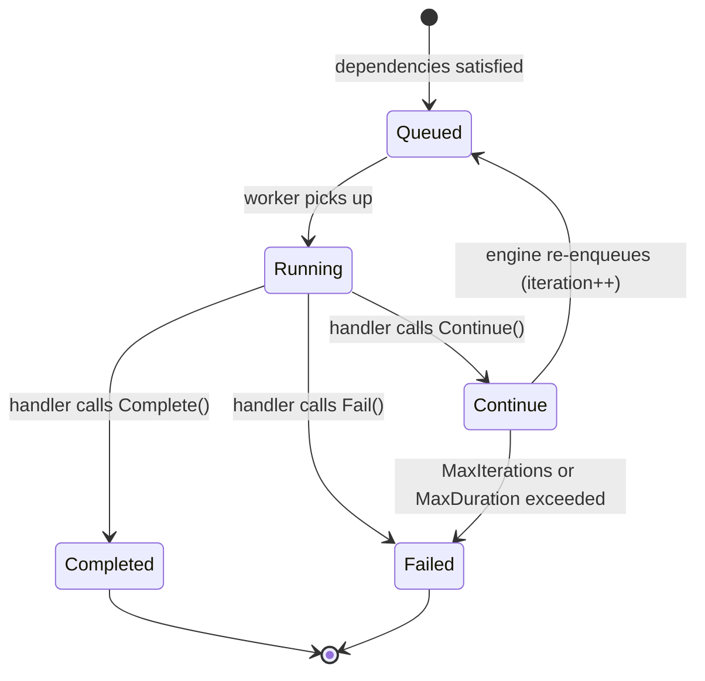

An **agent loop** step iterates until the handler signals completion or a bound is reached, making it the native primitive for LLM agent reasoning cycles.

## Overview

Agent loops solve a fundamental problem in AI workflows: the number of iterations is not known at definition time. An LLM agent might need 3 tool-call rounds or 30, depending on the task. Rather than modeling this as a fixed chain of steps, `StepTypeAgentLoop` lets a single step iterate in place, calling `Continue()` to request another iteration or `Complete()` to terminate.

Each iteration is a full task dispatch cycle -- the engine re-enqueues the step with an incremented iteration counter, and the worker picks it up again. This means every iteration gets its own NATS message with dedup protection, its own timeout enforcement, and its own trace span. The conversation state persists across iterations via the `Checkpoint()` / `LoadCheckpoint()` API on the worker's `TaskContext`.

Two hard bounds prevent runaway loops: **MaxIterations** caps the number of cycles, and **MaxDuration** caps wall-clock time from the first iteration. Whichever fires first terminates the loop. An optional **LoopDelay** adds spacing between iterations for rate-limited APIs.

## How It Works



When the engine enqueues an agent loop step, it includes the current `Iteration` count in the `TaskPayload`. The worker handler loads any saved checkpoint (conversation history, tool results), performs one reasoning cycle, and decides:

- **`Continue(output)`** -- publish a `step.continue` event. The engine increments the iteration counter, checks bounds, and re-enqueues the task. The output from `Continue()` becomes the input for the next iteration.
- **`Complete(output)`** -- publish a `step.completed` event. The loop terminates successfully, and downstream steps receive the final output.
- **`Fail(err)`** -- publish a `step.failed` event. Retry policy applies as normal.

The `Continue()` message ID includes a nonce (`UnixNano` timestamp) to handle the case where a worker crashes after calling `Continue()` but before acking the NATS message. On redelivery, the nonce ensures the new continue event is not swallowed by JetStream dedup.

## Usage

```go
wf := dag.NewWorkflow("code-review")

review := wf.AgentLoop("review", "llm-review").
    WithMaxIterations(10).
    WithMaxDuration(5 * time.Minute).
    WithLoopDelay(500 * time.Millisecond).
    WithTimeout(30 * time.Second)

def, err := wf.Build()
```

The handler uses checkpoint to persist conversation state:

```go
w.Handle("llm-review", func(ctx worker.TaskContext) error {
    history, _ := ctx.LoadCheckpoint()
    if history == nil {
        history = ctx.Input()
    }
    result, err := callLLM(history)
    if err != nil {
        return ctx.Fail(err)
    }
    ctx.Checkpoint(result.FullHistory)
    if result.Done {
        return ctx.Complete(result.Summary)
    }
    return ctx.Continue(result.ToolOutput)
})
```

## Configuration

Agent loop configuration is stored in `StepDef.Config` as `AgentLoopConfig`:

| Field | Type | Default | Purpose |
|-------|------|---------|---------|
| `max_iterations` | `int` | (required) | Maximum number of loop cycles. Must be > 0. |
| `max_duration` | `time.Duration` | 0 (unlimited) | Wall-clock bound from first iteration start |
| `loop_delay` | `time.Duration` | 0 (none) | Delay between re-enqueue cycles |

The `StepDef.Timeout` field controls the per-iteration timeout, not the total loop duration. Set `max_duration` to bound total wall-clock time.

## Related

- [Normal Steps](/docs/step-types/normal-steps) -- single-execution counterpart
- [Steps](/docs/concepts/steps) -- step lifecycle and StepDef fields
