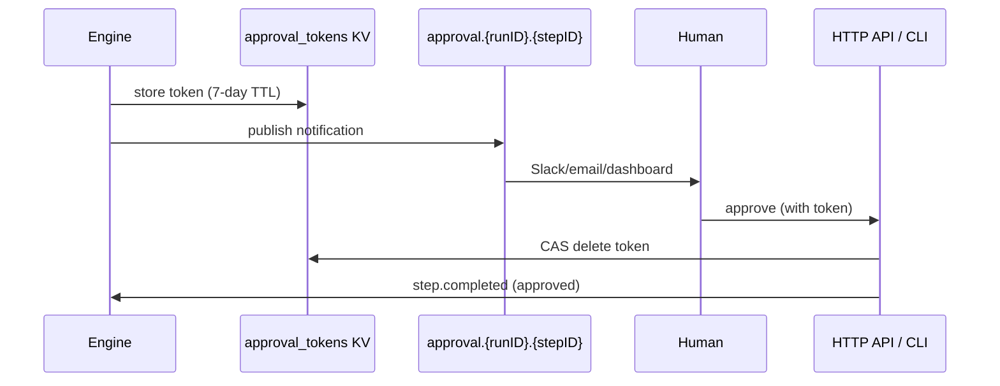

An **approval gate** pauses workflow execution until a human explicitly approves or rejects it, enabling human-in-the-loop workflows for sensitive operations.

## Overview

Approval gates address the requirement that some workflow steps should not proceed without human review. A deploy to production, a financial transaction above a threshold, or an AI agent's proposed action -- these are cases where automation must yield to human judgment.

When the engine reaches a `StepTypeApproval` step, it generates a **256-bit cryptographically random token**, stores it in the `approval_tokens` KV bucket with a 7-day TTL, and publishes a notification to a configurable NATS subject. External integrations (Slack bots, email systems, dashboards) subscribe to this subject and present the approve/reject action to the appropriate human. No worker is involved in the step itself.

The token ensures that only someone who received the notification can act on the approval. Atomic consumption via CAS (compare-and-swap) on the KV entry prevents double-approve race conditions. Once consumed, the token cannot be reused.

## How It Works



When a human approves or rejects:

- **Approve**: the engine publishes a `step.completed` event with `{"approved": true}` as output. Downstream steps proceed normally.
- **Reject**: the engine publishes a `step.failed` event. The workflow can handle this via `OnFailure` handlers or saga compensation.
- **Timeout**: if no action is taken within the configured timeout (max 7 days), the step auto-rejects.

The API exposes two endpoints for approval actions:

```
POST /runs/{id}/approval/{step_id}?action=approve&token={token}
POST /runs/{id}/approval/{step_id}?action=reject&token={token}
```

The CLI provides equivalent commands:

```bash
dagnats run approve <run-id> <step-id> --token=<token>
dagnats run reject <run-id> <step-id> --token=<token>
```

## Usage

```go
wf := dag.NewWorkflow("production-deploy")

plan := wf.Task("plan", "terraform-plan").
    WithTimeout(5 * time.Minute)

approve := wf.Approval("approve-deploy", dag.ApprovalConfig{
    Timeout:     24 * time.Hour,
    Subject:     "approval.deploy.production",
    Description: "Review terraform plan before apply",
    Metadata: map[string]string{
        "team":        "platform",
        "environment": "production",
    },
}).After(plan)

apply := wf.Task("apply", "terraform-apply").
    After(approve).
    WithTimeout(10 * time.Minute)

def, err := wf.Build()
```

## Configuration

Approval configuration is stored in `StepDef.Config` as `ApprovalConfig`:

| Field | Type | Required | Purpose |
|-------|------|----------|---------|
| `timeout` | `time.Duration` | Yes | How long to wait for a decision. Max 168h (7 days). |
| `subject` | `string` | Yes | NATS subject for notification publication |
| `description` | `string` | No | Human-readable description of what is being approved |
| `metadata` | `map[string]string` | No | Arbitrary key-value pairs passed in the notification |

**Constraints:**

- Timeout must be positive and at most 168 hours (7 days)
- Subject must be non-empty
- Token is 256-bit, cryptographically random
- Token stored in `approval_tokens` KV bucket with 7-day TTL
- CAS prevents double-approve

## Related

- [Wait for Event](/docs/step-types/wait-for-event) -- programmatic event correlation
- [Normal Steps](/docs/step-types/normal-steps) -- standard automated execution
