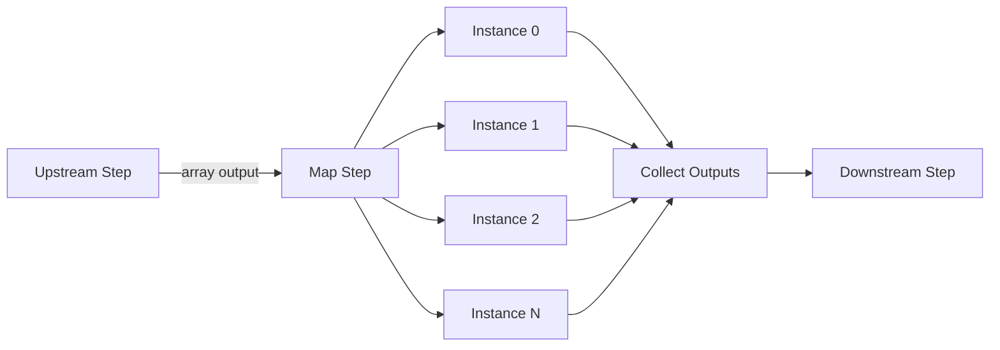

A **map step** fans out over an input array, executing one task per item in parallel, then collects all outputs into a single result.

## Overview

Map steps solve the parallel batch processing problem. When a step produces an array as its output, a downstream map step can process each element independently and concurrently. The engine creates one task instance per array item, dispatches them all to the `TASK_QUEUES` stream, and waits for every instance to complete before marking the map step as done.

This pattern is common in AI workflows -- an LLM might identify 5 files to modify, and a map step processes each file in parallel. Or an API returns a list of items that each need enrichment. The fan-out/fan-in is handled entirely by the engine; the worker handler sees each item individually, as if it were a normal step.

Map steps enforce a **fail-fast** policy: if any single instance fails (after retries), the entire map step fails immediately. Partial results are not propagated. The `MapConfig.MaxItems` field bounds the array size to prevent unbounded parallelism, defaulting to 1,000 with an absolute maximum of 10,000.

## How It Works



When the engine resolves a map step as ready, it reads the input (the upstream step's output), parses it as a JSON array, and publishes one task message per element. Each task message includes the array index so the engine can reassemble results in order.

Instance state is tracked in `StepState.MapInstances` -- a slice of `MapInstanceState` structs, each with its own status, output, and error. The engine updates the relevant instance on each `step.map.instance.completed` event. When all instances reach a terminal state, the engine publishes `step.map.completed` with the collected outputs as a JSON array.

Workers do not need any special handling for map steps. The handler receives one item as input and calls `Complete()` or `Fail()` exactly like a normal step. The fan-out/fan-in is invisible to the worker.

## Usage

```go
wf := dag.NewWorkflow("batch-enrich")

fetch := wf.Task("fetch", "fetch-items").
    WithTimeout(30 * time.Second)

enrich := wf.Map("enrich", "enrich-item").
    After(fetch).
    WithMaxItems(500).
    WithTimeout(10 * time.Second).
    WithRetries(2)

summarize := wf.Task("summarize", "aggregate").
    After(enrich)

def, err := wf.Build()
```

The worker handler processes one item at a time:

```go
w.Handle("enrich-item", func(ctx worker.TaskContext) error {
    var item Item
    if err := json.Unmarshal(ctx.Input(), &item); err != nil {
        return ctx.Fail(err)
    }
    enriched, err := callAPI(item)
    if err != nil {
        return ctx.Fail(err)
    }
    output, _ := json.Marshal(enriched)
    return ctx.Complete(output)
})
```

## Configuration

Map configuration is stored in `StepDef.Config` as `MapConfig`:

| Field | Type | Default | Purpose |
|-------|------|---------|---------|
| `max_items` | `int` | 1000 | Maximum array size. Capped at 10,000. |

**Behavior:**

- Input must be a JSON array. Non-array input causes the step to fail.
- **Fail-fast**: any instance failure fails the entire map step.
- Outputs are collected in original array order.
- Each instance gets its own retry budget (from the step's `Retries` field).

## Related

- [Normal Steps](/docs/step-types/normal-steps) -- single-item execution
- [Sub-Workflows](/docs/step-types/sub-workflows) -- composing entire workflows
- [Agent Loops](/docs/step-types/agent-loops) -- iterative single-step execution
