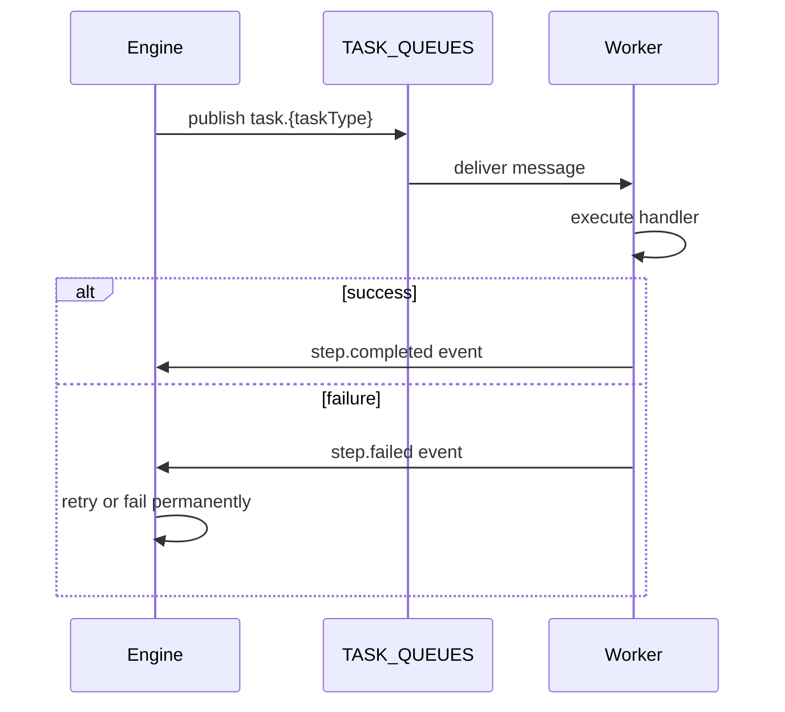

A **normal step** is the default step type -- it executes a task once on a worker, then completes or fails.

## Overview

Normal steps are the building blocks of most workflows. Each normal step is dispatched to a worker that has registered a handler for the step's task type. The worker receives the step's input (assembled from the outputs of upstream dependencies), performs its work, and calls `Complete()` with a result or `Fail()` with an error.

The engine routes normal steps through NATS JetStream pull consumers. When all of a step's dependencies reach a terminal state, the engine enqueues a task message on the `TASK_QUEUES` stream at subject `task.{taskType}`. A worker picks it up, executes the handler, and publishes a `step.completed` or `step.failed` event back to the history stream.

Normal steps support retries, timeouts, conditional skipping, worker group routing, on-failure handlers, and saga compensation -- all configured declaratively on the `StepDef`.

## How It Works



When a normal step's dependencies are all satisfied, the engine publishes a `TaskPayload` containing the run ID, step ID, attempt number, and merged input from upstream outputs. The worker's handler receives this as a `TaskContext` with read-only accessors (`Input()`, `RunID()`, `StepID()`, `RetryCount()`) and terminal actions (`Complete()`, `Fail()`, `FailPermanent()`, `FailRetryAfter()`).

## Usage

Define a workflow with normal steps using the builder API:

```go
wf := dag.NewWorkflow("data-pipeline")

fetch := wf.Task("fetch", "http-fetch").
    WithTimeout(30 * time.Second).
    WithRetries(3)

process := wf.Task("process", "transform").
    After(fetch).
    WithTimeout(60 * time.Second)

def, err := wf.Build()
```

Register a handler on a worker:

```go
w := worker.New(nc, tel)
w.Handle("http-fetch", func(ctx worker.TaskContext) error {
    url := gjson.GetBytes(ctx.Input(), "url").String()
    resp, err := http.Get(url)
    if err != nil {
        return ctx.Fail(err)
    }
    defer resp.Body.Close()
    body, _ := io.ReadAll(resp.Body)
    return ctx.Complete(body)
})
```

## Configuration

Normal steps use the base `StepDef` fields -- no type-specific `Config` is required.

| Field | Type | Purpose |
|-------|------|---------|
| `ID` | `string` | Unique step identifier within the workflow |
| `Task` | `string` | Task type that workers register handlers for |
| `DependsOn` | `[]string` | Step IDs that must complete before this step runs |
| `Timeout` | `time.Duration` | Per-attempt timeout (enforced via NATS AckWait) |
| `Retries` | `int` | Maximum retry attempts (0 = no retries) |
| `WorkerGroup` | `string` | Route to a specific worker group |
| `OnFailure` | `string` | Step ID to run on permanent failure |
| `Compensate` | `string` | Step ID for saga compensation |

## Related

- [Steps](/docs/concepts/steps) -- step lifecycle and StepDef fields
- [Workers](/docs/concepts/workers) -- how workers register and execute tasks
- [Agent Loops](/docs/step-types/agent-loops) -- iterative execution variant
