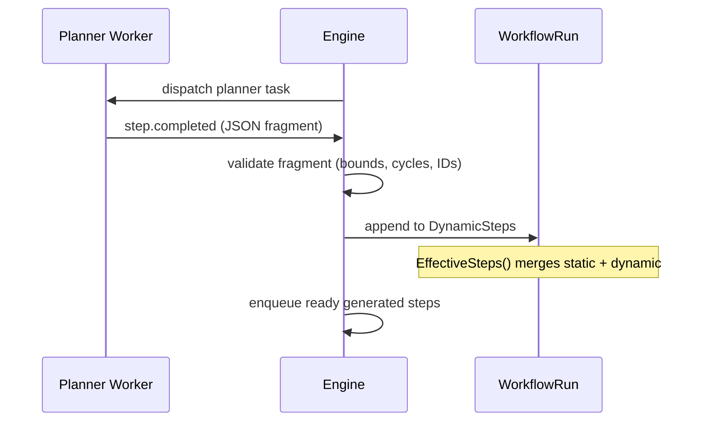

A **planner step** generates a DAG fragment at runtime, enabling workflows to create steps dynamically based on data or LLM output.

## Overview

Static DAGs require you to know every step at definition time. Planner steps remove that constraint. A `StepTypePlanner` step is a normal worker task whose output is not data -- it is a JSON DAG fragment containing steps and edges. The engine validates the fragment, namespaces the generated step IDs, and materializes them into the running workflow as `DynamicSteps`. From that point, the generated steps execute exactly like static ones.

This is the primitive that makes AI-planned workflows possible. An LLM can analyze a task, decide what subtasks are needed, emit a plan as structured JSON, and the engine executes it. The planner does not need to know the full workflow graph -- it only produces its fragment, and the engine merges it with the static definition.

Planner steps are bounded to prevent runaway generation: a single planner can emit at most **100 steps**, a single run can accumulate at most **500 dynamic steps** total, and the dependency chain depth within a fragment is capped at **10**. Generated step IDs are namespaced as `{plannerStepID}.{generatedID}` to prevent collisions with static steps or other planner fragments.

## How It Works



The engine performs several validation checks on the fragment before materialization:

1. **Bounds check**: step count within [1, `MaxSteps`], depth within [0, `MaxDepth`]
2. **Cycle detection**: the generated fragment must be a DAG
3. **ID collision check**: namespaced IDs must not collide with existing steps
4. **Task allowlist**: if `AllowedTasks` is configured, generated steps may only reference listed task types

After validation, the engine appends the fragment to `WorkflowRun.DynamicSteps` and publishes an `EventPlannerMaterialized` event for observability. The `EffectiveSteps()` method on the workflow run merges static steps from the definition with all dynamic steps, producing the complete step graph that the DAG resolver operates on.

**Output aggregation**: if the planner fragment has a single terminal step (no downstream dependencies within the fragment), its output becomes the planner step's output. If there are multiple terminal steps, their outputs are collected into a map keyed by step ID.

## Usage

```go
wf := dag.NewWorkflow("ai-pipeline")

analyze := wf.Task("analyze", "analyze-task").
    WithTimeout(30 * time.Second)

plan := wf.Planner("plan", "generate-plan", dag.PlannerConfig{
    MaxSteps:     20,
    MaxDepth:     5,
    AllowedTasks: []string{"code-edit", "test-run", "lint"},
}).After(analyze)

report := wf.Task("report", "summarize").
    After(plan)

def, err := wf.Build()
```

The planner worker returns a JSON fragment:

```go
w.Handle("generate-plan", func(ctx worker.TaskContext) error {
    plan := map[string]any{
        "steps": []map[string]any{
            {"id": "edit", "task": "code-edit"},
            {"id": "test", "task": "test-run",
                "depends_on": []string{"edit"}},
            {"id": "lint", "task": "lint",
                "depends_on": []string{"edit"}},
        },
    }
    output, _ := json.Marshal(plan)
    return ctx.Complete(output)
})
```

## Configuration

Planner configuration is stored in `StepDef.Config` as `PlannerConfig`:

| Field | Type | Default | Purpose |
|-------|------|---------|---------|
| `max_steps` | `int` | (required) | Maximum steps in the fragment. Range: 1-100. |
| `max_depth` | `int` | 0 | Maximum dependency chain depth. Range: 0-10. |
| `allowed_tasks` | `[]string` | (all allowed) | Restrict which task types may appear in the fragment |

**Global bounds:**

| Limit | Value |
|-------|-------|
| Steps per planner | 100 |
| Total dynamic steps per run | 500 |
| Max fragment depth | 10 |
| ID namespace | `{plannerStepID}.{generatedID}` |

## Related

- [Sub-Workflows](/docs/step-types/sub-workflows) -- static workflow composition
- [Map Steps](/docs/step-types/map-steps) -- parallel execution over arrays
- [Normal Steps](/docs/step-types/normal-steps) -- the step type that generated steps become
