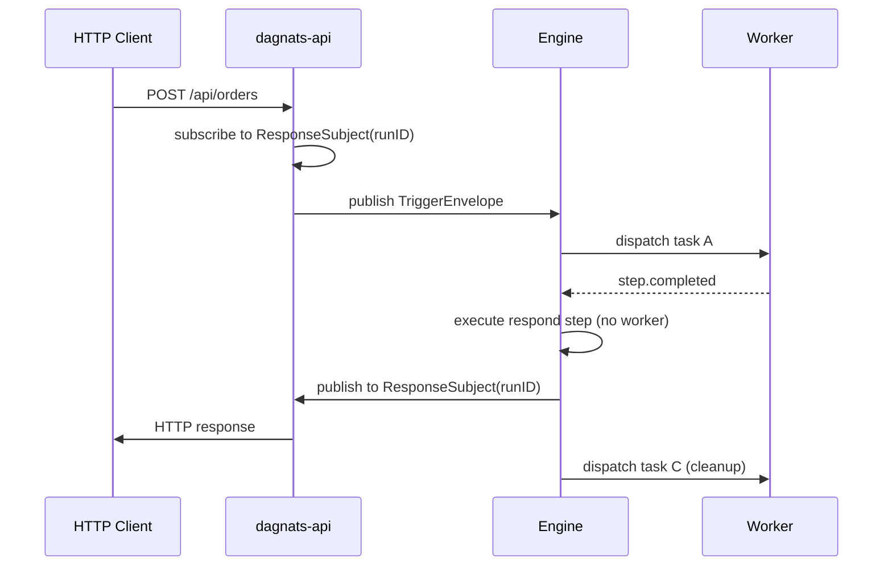

A **respond step** publishes the synchronous HTTP response for an [HTTP trigger](/docs/triggers/http). It is **engine-resolved** — no worker dispatch — and the DAG continues to advance past it like any other step.

## Overview

Respond steps exist to give a DAG-shaped workflow an explicit "return point" for an HTTP request. iii and Inngest bind the response to a function's return value; a DAG has no single return statement, so the response node is first-class instead.

A respond step:

- Reads its body from the upstream step's output, or from a dotpath ref via `body_from`.
- Publishes a single message to the engine-private subject `dagnats.http.response.<run_id>`.
- Emits a `step.completed` event so DAG advance continues.
- Lets subsequent steps run for cleanup, audit logging, or fanning out follow-ups — **after** the HTTP client has already received its response.

Respond is the only step type the engine resolves directly without worker dispatch. The body is purely a function of run state, so routing through a worker would buy nothing.

## How It Works



The API handler subscribes to the response subject **before** publishing the trigger envelope — closing a race a fast workflow could otherwise exploit. The engine's respond step executor (`internal/engine/respond_step.go`) reads `RespondConfig`, builds the wire payload, and publishes once.

## Usage

Declare a respond step in workflow JSON:

```json
{
  "id": "respond",
  "type": "respond",
  "depends_on": ["compute"],
  "config": {
    "status": 200,
    "content_type": "application/json",
    "headers": { "X-Source": "dagnats" }
  }
}
```

The body defaults to the immediate upstream step's output. To pull from a specific dotpath in run state, set `body_from`:

```json
{
  "id": "respond",
  "type": "respond",
  "depends_on": ["compute"],
  "config": {
    "status": 201,
    "body_from": "data.result.summary"
  }
}
```

## Configuration

| Field | Default | Purpose |
|-------|---------|---------|
| `status` | `200` | HTTP status code. |
| `content_type` | `"application/json"` | Sets the `Content-Type` response header. |
| `headers` | `{}` | Additional response headers. `X-Dagnats-Run-Id` is always set by the API handler regardless. |
| `body_from` | `""` (upstream output) | Dotpath into run state to pull the response body from. |

## Mental Model: Side Effect, Not Return

```
http trigger → [step A] → [step B] → respond → [step C] → [step D]
                                      │
                                      └─ HTTP response dispatched here
                                         (client connection released)
```

`[step C]` and `[step D]` run **after** the client has received the response. Their outputs are not visible to the caller.

**Anti-pattern:** put an auth-revocation, billing-charge, or any "must-complete-before-the-user-sees-success" operation *after* `respond`. The user has already seen success; the late step can fail silently. Put such steps **before** `respond`, or split them into a separate workflow keyed off the response event.

## Multiple Respond Branches

A DAG can have more than one respond step — for example, a happy path and an error path on mutually-exclusive branches. The graph validator at workflow registration warns if two respond steps are *simultaneously* reachable; branch-per-outcome patterns (gated by opposite `skip_if` on the same parent) are recognized as legitimate and pass without warning.

If two respond steps do execute in the same run, the originating API replica unsubscribes after the first publish — the second publish has no subscriber and is silently dropped at NATS. The HTTP response is already on the wire by then.

## Related

- [HTTP Trigger](/docs/triggers/http) — the trigger that pairs with respond steps.
- [Webhooks](/docs/triggers/webhooks) — the fire-and-forget alternative.
- [ADR-013](https://github.com/danmestas/dagnats/blob/main/docs/architecture/adr-013-http-trigger-respond-step.md) — design rationale.
