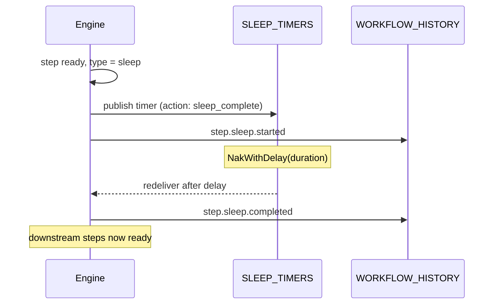

A **sleep step** introduces a durable delay into a workflow -- the engine handles the timer entirely, with no worker involved.

## Overview

Sleep steps pause workflow execution for a specified duration. Unlike a `time.Sleep()` in application code, a DagNats sleep is durable: it survives engine restarts, NATS reconnections, and server reboots. The delay is stored as a `WakeAt` timestamp in the step state, and the engine uses the `SLEEP_TIMERS` JetStream stream with `NakWithDelay` to schedule the wake-up.

No worker participates in a sleep step. The engine publishes a timer message to `SLEEP_TIMERS`, the NATS consumer NAKs it with the requested delay, and when NATS redelivers the message after the delay expires, the engine publishes a `step.sleep.completed` event to advance the workflow.

This is distinct from the worker-level `Pause()` method, which checkpoints mid-task state and uses `NakWithDelay` to resume the same worker handler. Sleep steps are DAG-level delays between steps; `Pause()` is a within-step delay that keeps the step in `Running` status.

## How It Works



The `SLEEP_TIMERS` stream is shared across multiple timer use cases via an **action discriminator** in the message payload. Sleep steps use the `sleep_complete` action. The same stream handles wait-for-event timeouts (`wait_timeout`), rate-limit retries (`rate_retry`), and other scheduled operations.

The step's `WakeAt` field in `StepState` records the expected completion time. This is purely informational -- the actual wake-up is driven by NATS redelivery, not by polling the timestamp.

## Usage

```go
wf := dag.NewWorkflow("rate-limited-pipeline")

call := wf.Task("call-api", "api-call").
    WithTimeout(10 * time.Second)

cooldown := wf.Sleep("cooldown", 30*time.Second).
    After(call)

next := wf.Task("next-call", "api-call").
    After(cooldown)

def, err := wf.Build()
```

## Configuration

Sleep configuration is stored in `StepDef.Config` as `SleepConfig`:

| Field | Type | Purpose |
|-------|------|---------|
| `duration` | `time.Duration` | How long to sleep. Must be positive. |

**Bounds:**

- Maximum: **365 days**
- A warning is logged for durations exceeding 30 days
- The engine sets `StepState.WakeAt` to `now + duration` when the sleep starts

**Sleep vs Pause:**

| | Sleep Step | Worker Pause |
|---|-----------|-------------|
| Scope | DAG-level, between steps | Within a step handler |
| Worker | None | Same worker resumes |
| Step status | Transitions through started/completed | Stays `Running` |
| Builder | `wf.Sleep(id, duration)` | `ctx.Pause(name, duration)` |
| Mechanism | `SLEEP_TIMERS` stream | Checkpoint + `NakWithDelay` |

## Related

- [Wait for Event](/docs/step-types/wait-for-event) -- pause until an external event arrives
- [Normal Steps](/docs/step-types/normal-steps) -- standard task execution
