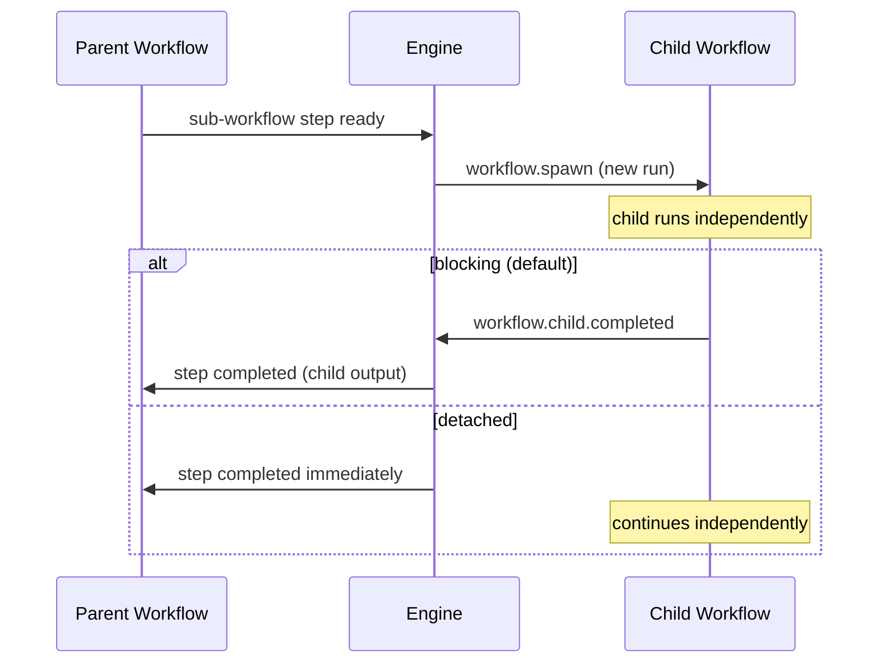

A **sub-workflow** step spawns a child workflow execution and optionally waits for it to complete, enabling composition of workflows into larger pipelines.

## Overview

Sub-workflows let you break complex pipelines into reusable, independently testable units. A parent workflow declares a `StepTypeSubWorkflow` step that references a child workflow by name. When the engine reaches that step, it starts a new run of the child workflow, passing the parent step's input as the child's input. The child runs independently with its own run ID, history stream, and step states.

By default, the parent step blocks until the child completes. The child's output becomes the parent step's output, available to downstream dependencies. If the child fails, the parent step fails too. This blocking behavior uses a KV watch pattern -- the engine watches for `workflow.child.completed` or `workflow.child.failed` events rather than polling.

For fire-and-forget scenarios, the **detach** mode lets the parent step complete immediately after spawning the child. The child continues running independently, and the parent workflow proceeds without waiting for a result.

## How It Works



The engine links parent and child through `ParentRunID` and `ParentStepID` fields on the child's `WorkflowRun`. This linkage serves two purposes: it enables the KV watch for completion notification, and it enforces the **maximum nesting depth of 3**. When spawning a child, the engine walks the parent chain and rejects the spawn if the depth would exceed 3 levels.

The child workflow must be registered in the `workflow_defs` KV bucket before the parent runs. The engine loads the child's `WorkflowDef` at spawn time and starts a fresh `WorkflowRun` with all steps initialized to pending.

## Usage

```go
wf := dag.NewWorkflow("deploy-pipeline")

build := wf.Task("build", "build-service").
    WithTimeout(5 * time.Minute)

// Blocking: parent waits for child to complete
deploy := wf.SubWorkflow("deploy", "deploy-to-staging").
    After(build)

// Detached: parent continues immediately
notify := wf.SubWorkflow("notify", "send-notifications").
    After(deploy).
    WithDetach()

def, err := wf.Build()
```

## Configuration

Sub-workflow configuration is stored in `StepDef.Config` as `SubWorkflowConfig`:

| Field | Type | Default | Purpose |
|-------|------|---------|---------|
| `workflow` | `string` | (required) | Name of the child workflow definition to spawn |
| `detach` | `bool` | `false` | If true, parent completes immediately after spawn |

**Constraints:**

- Maximum nesting depth: **3** (enforced at spawn time)
- The child workflow must exist in the `workflow_defs` KV bucket
- The `Task` field on the `StepDef` is set to the workflow name by the builder

## Related

- [Normal Steps](/docs/step-types/normal-steps) -- single-execution steps
- [Planner Steps](/docs/step-types/planner-steps) -- dynamic DAG generation at runtime
- [Workflows and DAGs](/docs/concepts/workflows-and-dags) -- workflow definition and structure
