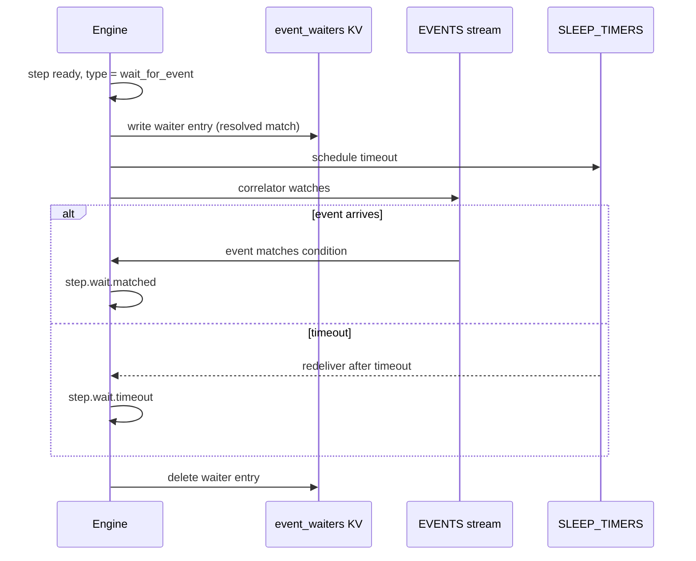

A **wait-for-event step** blocks workflow execution until a matching external event arrives or a timeout expires.

## Overview

Wait-for-event steps implement **event correlation** -- the ability to pause a workflow and resume it when a specific external event matches a declared condition. This is the pull-based counterpart to signals (which are push-based and target a specific run ID). With wait-for-event, the workflow declares what it is waiting for, and the engine's correlator matches incoming events automatically.

The step declares three things: an **event type** to listen for, a **match condition** that compares a field in the event payload against a resolved value (from workflow input or a prior step's output), and a **timeout** after which the step completes with a timeout marker rather than failing.

No worker is involved. The engine handles the entire lifecycle: writing a waiter entry to the `event_waiters` KV bucket, subscribing to the `EVENTS` stream, and publishing `step.wait.matched` or `step.wait.timeout` when the condition resolves.

## How It Works



The **correlator** runs inside the orchestrator process (not a separate component). It maintains an in-memory index of active waiters by event type, populated via a KV watch on `event_waiters.>`. When an event arrives on the `EVENTS` stream, the correlator performs an **O(1) lookup** by event type, then evaluates each waiter's `ResolvedMatch` against the event payload.

Match conditions use two types that split builder-time and runtime concerns:

- **`Match`** (builder-time): both `Left` and `Right` are dot-path strings. `Left` references a field in the incoming event. `Right` references a value from `step.{id}.output.{field}` or `input.{field}`.
- **`ResolvedMatch`** (runtime): `Right` is resolved to a concrete value when the waiter is created. This avoids re-resolving on every event.

Timeouts are not failures. When a wait-for-event step times out, it completes with `{"timeout": true}` as output. Downstream steps can inspect this output to branch accordingly using `SkipIf`.

## Usage

```go
wf := dag.NewWorkflow("webhook-handler")

create := wf.Task("create-order", "create-order").
    WithTimeout(10 * time.Second)

wait := wf.WaitForEvent("payment", dag.WaitForEventOpts{
    Event:   "payment.received",
    Match:   dag.Match{
        Left:  "order_id",
        Op:    dag.MatchOpEq,
        Right: "step.create-order.output.id",
    },
    Timeout: 1 * time.Hour,
}).After(create)

fulfill := wf.Task("fulfill", "fulfill-order").
    After(wait)

def, err := wf.Build()
```

External systems publish events to the `EVENTS` stream:

```go
eventData := `{"order_id": "ord_123", "amount": 99.99}`
js.Publish("event.payment.received", []byte(eventData))
```

## Configuration

Wait-for-event configuration is stored in `StepDef.Config` as `WaitForEventOpts`:

| Field | Type | Purpose |
|-------|------|---------|
| `event` | `string` | Event type to listen for (e.g. `payment.received`) |
| `match` | `Match` | Condition: `left` (event field) `op` `right` (resolved value) |
| `timeout` | `time.Duration` | How long to wait before completing with timeout output |

**Match operators:**

| Operator | Meaning |
|----------|---------|
| `eq` | String equality after `fmt.Sprintf("%v", val)` |

**Bounds:**

- Maximum 10,000 active waiters per event type
- Timeout is required and must be positive
- On workflow cancellation, waiter KV entries are cleaned up

## Related

- [Sleep and Timers](/docs/step-types/sleep-and-timers) -- durable delays without event matching
- [Approval Gates](/docs/step-types/approval-gates) -- human-in-the-loop variant
