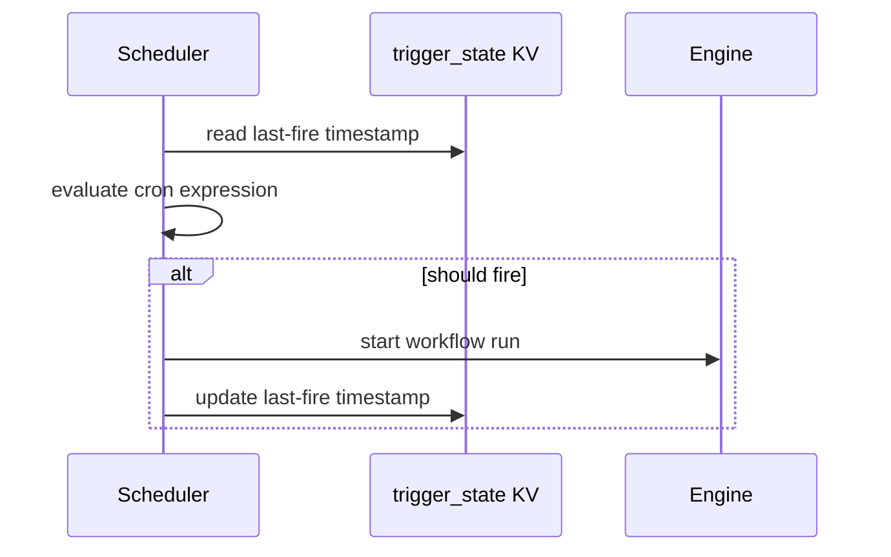

Cron triggers start workflow runs on a recurring schedule, managed entirely through the CLI and persisted in the `triggers` KV bucket.

## Creating a Cron Trigger

Use `dagnats trigger create` with the `--cron` flag to register a scheduled trigger:

```bash
dagnats trigger create daily-report \
  --workflow report-pipeline \
  --cron "0 9 * * *" \
  --input '{"format": "pdf"}'
```

This creates a trigger named `daily-report` that starts a `report-pipeline` run every day at 9:00 AM.

## Cron Syntax

DagNats uses standard five-field cron syntax:

```
┌───────────── minute (0-59)
│ ┌───────────── hour (0-23)
│ │ ┌───────────── day of month (1-31)
│ │ │ ┌───────────── month (1-12)
│ │ │ │ ┌───────────── day of week (0-6, Sunday=0)
│ │ │ │ │
* * * * *
```

| Expression | Schedule |
|------------|----------|
| `*/15 * * * *` | Every 15 minutes |
| `0 9 * * 1-5` | Weekdays at 9:00 AM |
| `0 0 1 * *` | First of every month at midnight |
| `30 */2 * * *` | Every 2 hours at :30 |

## Timezone

By default, cron expressions are evaluated in UTC. Specify a timezone with `--timezone`:

```bash
dagnats trigger create standup-reminder \
  --workflow notify \
  --cron "0 9 * * 1-5" \
  --timezone "America/Denver"
```

## Trigger Lifecycle

Triggers are stored as JSON in the `triggers` KV bucket. The scheduler evaluates all active triggers on each tick, comparing the current time against each trigger's cron expression and its last-fire timestamp from the `trigger_state` KV bucket.

### Managing Triggers

```bash
# List all triggers
dagnats trigger list

# Inspect a trigger
dagnats trigger get daily-report

# Delete a trigger
dagnats trigger delete daily-report
```

### Trigger State

The `trigger_state` KV bucket stores the last-run timestamp for each cron trigger. This prevents duplicate fires after a scheduler restart -- the scheduler compares "now" against the stored timestamp to determine whether a tick should fire.

If the scheduler was down during a scheduled time, it performs a **backfill** on startup, evaluating missed windows and firing any triggers that should have run. Backfill evaluates triggers concurrently using `errgroup` for performance.

## How It Works



The scheduler runs inside the `dagnats serve` process. Each tick evaluates all triggers independently -- one failing trigger does not block the others.

## Related Pages

- [CLI and API](/docs/triggers/cli-and-api) -- manual run triggers
- [Event Triggers](/docs/triggers/event-triggers) -- event-driven triggers
- [Concurrency Limits](/docs/flow-control/concurrency-limits) -- preventing trigger overload
