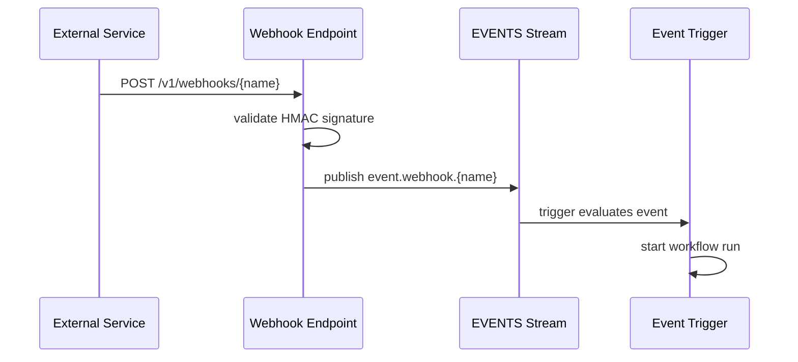

Webhook triggers expose an HTTP endpoint that translates incoming HTTP requests into NATS events, bridging external services like GitHub, Stripe, or custom systems into DagNats workflows.

## How It Works

The webhook endpoint runs on the `dagnats serve` HTTP mux. When a request arrives, the server validates the request, extracts the payload, and publishes it to the `EVENTS` stream where event triggers pick it up.



## Request Validation

Webhook endpoints validate incoming requests using HMAC-SHA256 signatures. The shared secret is configured per-trigger or via the `DAGNATS_WEBHOOK_SECRET` environment variable.

### Setting the Secret

**Environment variable** (applies as default for all webhooks):

```bash
export DAGNATS_WEBHOOK_SECRET="whsec_your_secret_here"
dagnats serve
```

**Per-trigger** (overrides the environment variable):

```bash
dagnats trigger create github-push \
  --workflow ci-pipeline \
  --webhook \
  --secret "whsec_github_specific_secret"
```

The `--secret` flag always takes precedence over `DAGNATS_WEBHOOK_SECRET`. Using the environment variable keeps secrets out of shell history.

### Signature Verification

The webhook endpoint expects a signature header in the request. It computes `HMAC-SHA256(secret, request_body)` and compares against the provided signature. Requests with invalid or missing signatures receive a `401 Unauthorized` response.

## Creating a Webhook Trigger

Combine `--webhook` with a workflow binding:

```bash
dagnats trigger create stripe-payment \
  --workflow payment-processor \
  --webhook \
  --secret "whsec_stripe_secret"
```

This creates an endpoint at `/v1/webhooks/stripe-payment`. Configure the external service to send `POST` requests to this URL.

The request body becomes the workflow run's input. Content-Type must be `application/json`.

## Connecting to Event Triggers

Webhooks publish to `event.webhook.{trigger-name}` on the `EVENTS` stream. You can also create a separate event trigger that listens to webhook subjects for additional filtering or debouncing:

```bash
# Webhook ingests the HTTP request
dagnats trigger create github-events \
  --workflow github-handler \
  --webhook

# Separate trigger with filtering
dagnats trigger create on-pr-opened \
  --workflow pr-review \
  --subject "event.webhook.github-events" \
  --filter-field "action" \
  --filter-value "opened"
```

## Related Pages

- [Event Triggers](/docs/triggers/event-triggers) -- NATS-native event triggers
- [CLI and API](/docs/triggers/cli-and-api) -- manual run creation
